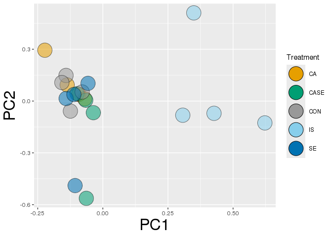
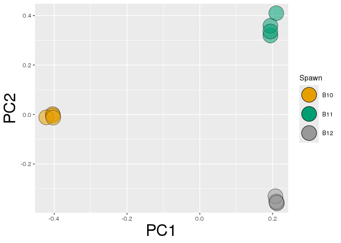
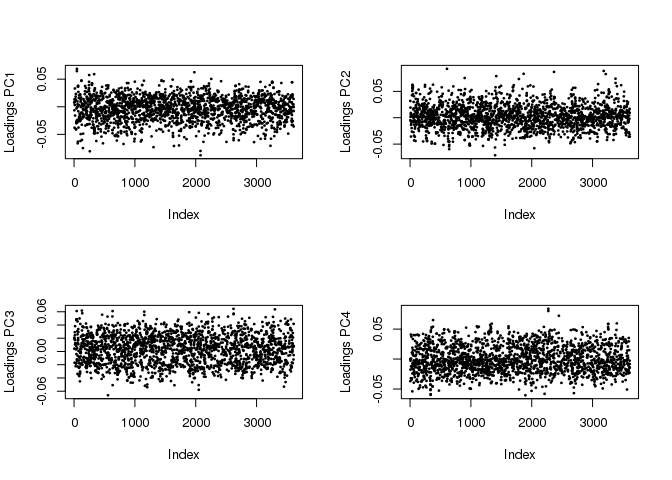
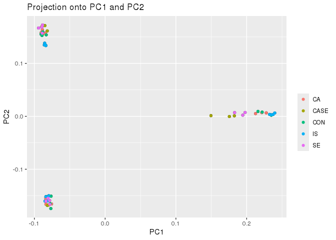
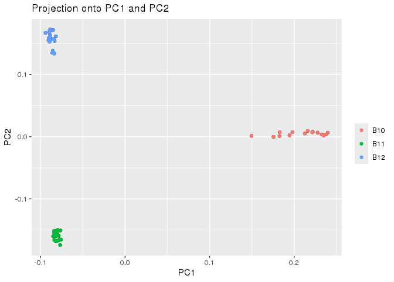
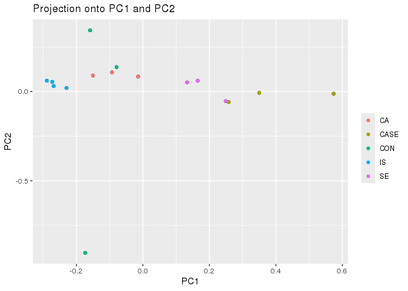
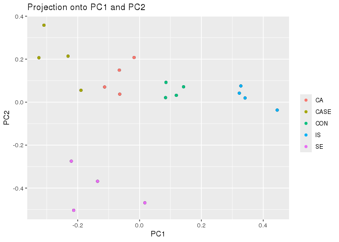
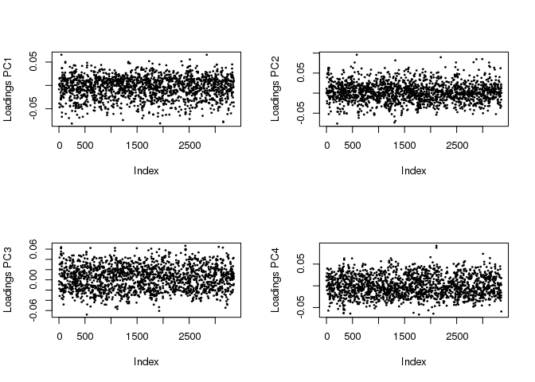

CASE Full FINAL
================

# Setup

``` r
sessionInfo()
```

    ## R version 3.6.0 (2019-04-26)
    ## Platform: x86_64-pc-linux-gnu (64-bit)
    ## Running under: Scientific Linux 7.4 (Nitrogen)
    ## 
    ## Matrix products: default
    ## BLAS:   /usr/local/lib64/R/lib/libRblas.so
    ## LAPACK: /usr/local/lib64/R/lib/libRlapack.so
    ## 
    ## locale:
    ##  [1] LC_CTYPE=en_US.UTF-8       LC_NUMERIC=C              
    ##  [3] LC_TIME=en_US.UTF-8        LC_COLLATE=en_US.UTF-8    
    ##  [5] LC_MONETARY=en_US.UTF-8    LC_MESSAGES=en_US.UTF-8   
    ##  [7] LC_PAPER=en_US.UTF-8       LC_NAME=C                 
    ##  [9] LC_ADDRESS=C               LC_TELEPHONE=C            
    ## [11] LC_MEASUREMENT=en_US.UTF-8 LC_IDENTIFICATION=C       
    ## 
    ## attached base packages:
    ## [1] stats     graphics  grDevices utils     datasets  methods   base     
    ## 
    ## other attached packages:
    ##  [1] ggman_0.99.0       ggrepel_0.9.5.9999 ACER_1.0           poolSeq_0.3.5     
    ##  [5] Rcpp_1.0.12        matrixStats_0.57.0 stringi_1.7.8      foreach_1.5.0     
    ##  [9] data.table_1.14.2  pcadapt_4.3.3      stringr_1.4.0      plyr_1.8.6        
    ## [13] qvalue_2.18.0      dplyr_1.0.7        tidyr_1.1.4        ggplot2_3.5.0     
    ## 
    ## loaded via a namespace (and not attached):
    ##  [1] gtools_3.8.2     tidyselect_1.1.1 xfun_0.31        purrr_1.0.2     
    ##  [5] reshape2_1.4.4   splines_3.6.0    colorspace_2.1-0 vctrs_0.6.5     
    ##  [9] generics_0.1.1   htmltools_0.5.2  yaml_2.2.1       utf8_1.2.4      
    ## [13] blob_1.2.1       rlang_1.1.3      pillar_1.9.0     glue_1.7.0      
    ## [17] withr_3.0.0      DBI_1.1.0        lifecycle_1.0.4  munsell_0.5.0   
    ## [21] gtable_0.3.4     codetools_0.2-16 evaluate_0.15    knitr_1.39      
    ## [25] fastmap_1.1.0    fansi_1.0.6      scales_1.3.0     digest_0.6.29   
    ## [29] grid_3.6.0       cli_3.6.2        tools_3.6.0      magrittr_2.0.3  
    ## [33] tibble_3.2.1     pkgconfig_2.0.3  assertthat_0.2.1 rmarkdown_2.12  
    ## [37] rstudioapi_0.13  iterators_1.0.12 R6_2.5.1         compiler_3.6.0

## Download Popoolation2 scripts

``` bash
cd ../scripts
git clone https://github.com/ToBoDev/assessPool.git
```

## Create conda (mamba) environment

``` bash
mamba env create --file ../CASE_environment.yaml
```

# Filtering

``` bash
source activate CASE
cd ../raw.vcf
bash ../scripts/CASE_PVCF_filter2.sh CASE 64 20
```

``` bash
source activate CASE
cd ../raw.vcf 
bcftools index CASE.TRSdp.20.g5.nDNA.FIL.vcf.gz
bcftools query -l CASE.TRSdp.20.g5.nDNA.FIL.vcf.gz > samples
```

## Break up into Spawns (Blocks)

``` bash
source activate CASE

cd ../raw.vcf
bcftools view -S <(grep B11 samples | grep -v 1.G) CASE.TRSdp.20.g5.nDNA.FIL.vcf.gz | bcftools view -i 'F_MISSING<0.1'  | bcftools view -M 4 -m 2 | bcftools +fill-tags -- -t 'AAF:1=sum(FORMAT/AO)/sum(FORMAT/DP)' | bcftools +fill-tags -- -t  FORMAT/VAF | bcftools view --threads 40 -i 'AAF > 0.015 && AAF < 0.985' -O z -o B11.CASE.FIL.vcf.gz

bcftools index B11.CASE.FIL.vcf.gz

bcftools query -f '%CHROM\t%POS\n' B11.CASE.FIL.vcf.gz > B11.pos

bcftools view -S <(grep B10 samples | grep -v J17 | grep -v J05) CASE.TRSdp.20.g5.nDNA.FIL.vcf.gz | bcftools view -i 'F_MISSING<0.1' | bcftools view -M 4 -m 2 | bcftools +fill-tags -- -t 'AAF:1=sum(FORMAT/AO)/sum(FORMAT/DP)' | bcftools +fill-tags -- -t  FORMAT/VAF | bcftools view --threads 40 -i 'AAF > 0.015 && AAF < 0.985' -O z -o B10.CASE.FIL.vcf.gz
bcftools index B10.CASE.FIL.vcf.gz
bcftools query -f '%CHROM\t%POS\n' B10.CASE.FIL.vcf.gz > B10.pos

bcftools view -S <(grep B12 samples) CASE.TRSdp.20.g5.nDNA.FIL.vcf.gz | bcftools view -i 'F_MISSING<0.1' | bcftools view -M 4 -m 2 | bcftools +fill-tags -- -t 'AAF:1=sum(FORMAT/AO)/sum(FORMAT/DP)' | bcftools +fill-tags -- -t  FORMAT/VAF | bcftools view --threads 40 -i 'AAF > 0.015 && AAF < 0.985' -O z -o B12.CASE.FIL.vcf.gz
bcftools index B12.CASE.FIL.vcf.gz
bcftools query -f '%CHROM\t%POS\n' B12.CASE.FIL.vcf.gz > B12.pos

cat B*.pos | sort | uniq > fil.pos

bcftools view -R fil.pos --threads 40 -m2 -M 4 CASE.TRSdp.20.g5.nDNA.FIL.vcf.gz -O z -o SNP.CASE.TRSdp.20.B90.2a.perp.vcf.gz

bcftools view --threads 40 SNP.CASE.TRSdp.20.B90.2a.perp.vcf.gz | mawk '!/#/' | cut -f 1,2 | mawk '{print $1"\t"$2-1"\t"$2}' > total.snp.bed
bedtools intersect -wb -a total.snp.bed -b ~/CASE/analysis/sorted.ref3.0.gene.bed | grep -oh "gene=LOC.*;g" | sed 's/gene=//g' | sed 's/;g//g' | sort | uniq > CASE.study.background.LOC
```

### Create Sync files

``` bash
source activate CASE

bcftools view --threads 40 ../raw.vcf/B10.CASE.FIL.vcf.gz | mawk '!/\.:\.:\./' > temp.vcf
python2 ../scripts/VCFtoPopPool.py temp.vcf CASE.Block10.sync 
rm temp.vcf

bcftools view --threads 40 ../raw.vcf/B11.CASE.FIL.vcf.gz | mawk '!/\.:\.:\./' > temp.vcf
python2 ../scripts/VCFtoPopPool.py temp.vcf CASE.Block11.sync 
rm temp.vcf

bcftools view --threads 40 ../raw.vcf/B12.CASE.FIL.vcf.gz  | mawk '!/\.:\.:\./' > temp.vcf
python2 ../scripts/VCFtoPopPool.py temp.vcf CASE.Block12.sync 
rm temp.vcf

bcftools view --threads 40 ../raw.vcf/SNP.CASE.TRSdp.20.B90.2a.perp.vcf.gz  | mawk '!/\.:\.:\./' > temp.vcf
python2 ../scripts/VCFtoPopPool.py temp.vcf CASE.All.Blocks.sync 
rm temp.vcf
```

## Add coverage stats to sync file and filter by minimum coverage

``` bash
source activate CASE
mawk -f ../scripts/add_cov_sync CASE.Block10.sync | mawk '$20 > 10 && $22 > 24'> CASE.dp20.Block10.cov.sync &
mawk -f ../scripts/add_cov_sync CASE.Block11.sync | mawk '$24 > 4 && $26 > 24'> CASE.dp20.Block11.cov.sync &
mawk -f ../scripts/add_cov_sync CASE.Block12.sync | mawk '$24 > 10 && $26 > 24'> CASE.dp20.Block12.cov.sync &
mawk -f ../scripts/add_cov_sync CASE.All.Blocks.sync | mawk '$66 > 4 && $68 > 24' > CASE.All.Blocks.cov.sync
```

# Visualize across 10,000 random loci

## B10

``` bash
source activate CASE
timeout 1s mawk '!/CHR/' CASE.dp20.Block10.cov.sync | cut -f 1-19 | shuf | shuf | head -q -n 11000 > input.b10.rand.sync 
../scripts/assessPool/scripts/p2/snp-frequency-diff.pl --input input.b10.rand.sync --output-prefix B10.dp20.rand --max-coverage 50000 

mawk -f ../scripts/polarize_freqs B10.dp20.rand_rc | grep -Ei '(A{16}|C{16}|G{16}|T{16})'| head -q -n 10000| cut -f10-25 | mawk '!/maa/'   > B10.dp20.rand.pool 
```

``` r
pool.data.b10 <- read.table("B10.dp20.rand.pool")
df.pool.b10 <- apply(pool.data.b10, c(1, 2), function(x) eval(parse(text = x)))
df_filtered <- df.pool.b10[!apply(df.pool.b10, 1, function(row) all(row == row[1])), ]

pool.data2.b10 <- t(df_filtered)
filename.b10 <- read.pcadapt(pool.data2.b10, type = "pool")

res.b10.rand <- pcadapt(filename.b10, K =5,min.maf = 0.01)

poplist.names <- c(rep("CA", 3),rep("CASE", 3),rep("CON", 3),rep("IS", 4),rep("SE", 3))
p1.b10.rand.df <- data.frame(res.b10.rand$scores)
colnames(p1.b10.rand.df) <- c("PC1","PC2", "PC3", "PC4")
p1.b10.rand.df$POP <- poplist.names
ggplot(p1.b10.rand.df, aes(x=PC1, y= PC2, fill= POP)) + geom_point(aes(alpha=0.2), size =10,shape=21, col="black")+  scale_fill_manual(values=cbPaletteSmall,name="Treatment")+ 
guides(alpha=FALSE) +theme(axis.title.x = element_text(size = 24),axis.title.y = element_text(size = 24))
```

<!-- -->

``` r
png(filename="PC_B10_rand.png", type="cairo",units="px", width=5400, height=3000, res=300, bg="transparent")
ggplot(p1.b10.rand.df, aes(x=PC1, y= PC2, fill= POP)) + geom_point(aes(alpha=0.2), size =10,shape=21, col="white")+ theme_black() + scale_fill_manual(values=cbPaletteSmall,name="Treatment")+ 
guides(alpha=FALSE) +theme(axis.title.x = element_text(size = 24),axis.title.y = element_text(size = 24))
dev.off()
```

    ## png 
    ##   2

## B11

``` bash
source activate CASE

mawk '!/CHR/' CASE.dp20.Block11.cov.sync | cut -f1-23 | shuf | shuf -n 11000 > input.b11.rand.sync
../scripts/assessPool/scripts/p2/snp-frequency-diff.pl --input input.b11.rand.sync --output-prefix B11.dp20.rand --max-coverage 50000 

mawk -f ../scripts/polarize_freqs B11.dp20.rand_rc | grep -Ei '(A{20}|C{20}|G{20}|T{20})' | mawk '!/maa/' | cut -f10-29 | head -q -n 10000 > B11.dp20.rand.pool
```

``` r
pool.data.b11 <- read.table("B11.dp20.rand.pool")
df.pool.b11 <- apply(pool.data.b11, c(1, 2), function(x) eval(parse(text = x)))
df_filtered <- df.pool.b11[!apply(df.pool.b11, 1, function(row) all(row == row[1])), ]

pool.data2.b11 <- t(df_filtered)
filename.b11 <- read.pcadapt(pool.data2.b11, type = "pool")

res.b11.rand <- pcadapt(filename.b11, K =5,min.maf = 0.01)

poplist.names <- c(rep("CA", 4),rep("CASE", 4),rep("CON", 4),rep("IS", 4),rep("SE", 4))
p1.b11.rand.df <- data.frame(res.b11.rand$scores)
colnames(p1.b11.rand.df) <- c("PC1","PC2", "PC3", "PC4")
p1.b11.rand.df$POP <- poplist.names
ggplot(p1.b11.rand.df, aes(x=PC1, y= PC2, fill= POP)) + geom_point(aes(alpha=0.2), size =10,shape=21, col="black")+  scale_fill_manual(values=cbPaletteSmall,name="Treatment")+ 
guides(alpha=FALSE) +theme(axis.title.x = element_text(size = 24),axis.title.y = element_text(size = 24))
```

<!-- -->

``` r
png(filename="PC_B11_rand.png", type="cairo",units="px", width=5400, height=3000, res=300, bg="transparent")
ggplot(p1.b11.rand.df, aes(x=PC1, y= PC2, fill= POP)) + geom_point(aes(alpha=0.2), size =10,shape=21, col="white")+ theme_black() + scale_fill_manual(values=cbPaletteSmall,name="Treatment")+ 
guides(alpha=FALSE) +theme(axis.title.x = element_text(size = 24),axis.title.y = element_text(size = 24))
dev.off()
```

    ## png 
    ##   2

## B12

``` bash
source activate CASE

mawk '!/CHR/' CASE.dp20.Block12.cov.sync | cut -f1-23 > temp1
shuf temp1 | shuf -n 11000  > input.b12.rand.sync
rm temp1
../scripts/assessPool/scripts/p2/snp-frequency-diff.pl --input input.b12.rand.sync --output-prefix B12.dp20.rand --max-coverage 50000 

mawk -f ../scripts/polarize_freqs B12.dp20.rand_rc |  grep -Ei '(A{20}|C{20}|G{20}|T{20})' -m 10000 | cut -f10-29  > B12.dp20.rand.pool
```

``` r
pool.data.b12 <- read.table("B12.dp20.rand.pool")
df.pool.b12 <- apply(pool.data.b12, c(1, 2), function(x) eval(parse(text = x)))
df_filtered <- df.pool.b12[!apply(df.pool.b12, 1, function(row) all(row == row[1])), ]

pool.data2.b12 <- t(df_filtered)
filename.b12 <- read.pcadapt(pool.data2.b12, type = "pool")

res.b12.rand <- pcadapt(filename.b12, K =5,min.maf = 0.01)

poplist.names <- c(rep("CA", 4),rep("CASE", 4),rep("CON", 4),rep("IS", 4),rep("SE", 4))
p1.b12.rand.df <- data.frame(res.b12.rand$scores)
colnames(p1.b12.rand.df) <- c("PC1","PC2", "PC3", "PC4")
p1.b12.rand.df$POP <- poplist.names
ggplot(p1.b12.rand.df, aes(x=PC1, y= PC2, fill= POP)) + geom_point(aes(alpha=0.2), size =10,shape=21, col="black")+  scale_fill_manual(values=cbPaletteSmall,name="Treatment")+ 
guides(alpha=FALSE) +theme(axis.title.x = element_text(size = 24),axis.title.y = element_text(size = 24))
```

<!-- -->

``` r
png(filename="PC_B12_rand.png", type="cairo",units="px", width=5400, height=3000, res=300, bg="transparent")
ggplot(p1.b12.rand.df, aes(x=PC1, y= PC2, fill= POP)) + geom_point(aes(alpha=0.2), size =10,shape=21, col="white")+ theme_black() + scale_fill_manual(values=cbPaletteSmall,name="Treatment")+ 
guides(alpha=FALSE) +theme(axis.title.x = element_text(size = 24),axis.title.y = element_text(size = 24))
dev.off()
```

    ## png 
    ##   2

## All

``` bash
source activate CASE

mawk '!/CHR/' CASE.All.Blocks.cov.sync | mawk '$66 > 10' | cut --complement -f15,4,17,29,40,65- | shuf -n 50000 | shuf -n 11000  > input.all.rand.sync
../scripts/assessPool/scripts/p2/snp-frequency-diff.pl --input input.all.rand.sync --output-prefix all.dp20.rand --max-coverage 50000 

mawk -f ../scripts/polarize_freqs all.dp20.rand_rc | grep -Ei '(A{20}|C{20}|G{20}|T{20})' -m 10000 | cut -f10-65  > all.dp20.rand.pool
```

``` r
pool.data.all <- read.table("all.dp20.rand.pool")
df.pool.all <- apply(pool.data.all, c(1, 2), function(x) eval(parse(text = x)))
df_filtered.all <- df.pool.all[!apply(df.pool.all, 1, function(row) all(row == row[1])), ]

pool.data2.all <- t(df_filtered.all)
filename.all <- read.pcadapt(pool.data2.all, type = "pool")

res.all.rand <- pcadapt(filename.all, K =5,min.maf = 0.0001)

poplist.names <- c(rep("CA", 11),rep("CASE", 11),rep("CON", 11),rep("IS", 12),rep("SE", 11))
poplist.names <- c("B12","B11","B12","B10","B11","B10","B11","B12","B10","B12","B11","B10","B11","B12","B12","B10","B12","B11","B10","B11","B11","B12","B10","B11","B12","B11","B10","B12","B10","B11","B12","B11","B12","B10","B11","B10","B11","B10","B11","B10","B11","B12","B12","B12","B12","B11","B12","B10","B10","B11","B11","B10","B12","B12","B11","B12")
p1.all.rand.df <- data.frame(res.all.rand$scores)
colnames(p1.all.rand.df) <- c("PC1","PC2", "PC3", "PC4")
p1.all.rand.df$POP <- poplist.names
ggplot(p1.all.rand.df, aes(x=PC1, y= PC2, fill= POP)) + geom_point(aes(alpha=0.2), size =10,shape=21, col="black")+  scale_fill_manual(values=cbPaletteSmall,name="Treatment")+ 
guides(alpha=FALSE) +theme(axis.title.x = element_text(size = 24),axis.title.y = element_text(size = 24))
```

<!-- -->

``` r
png(filename="PC_all_rand.png", type="cairo",units="px", width=5400, height=3000, res=300, bg="transparent")
ggplot(p1.all.rand.df, aes(x=PC1, y= PC2, fill= POP)) + geom_point(aes(alpha=0.2), size =10,shape=21, col="white")+ theme_black() + scale_fill_manual(values=cbPaletteSmall,name="Treatment")+ 
guides(alpha=FALSE) +theme(axis.title.x = element_text(size = 24),axis.title.y = element_text(size = 24))
dev.off()
```

    ## png 
    ##   2

## All Initial Samples

``` bash
source activate CASE

mawk -f ../scripts/polarize_freqs all.dp20.rand_rc | grep -Ei '(A{20}|C{20}|G{20}|T{20})' -m 10000 | cut -f43-54  > all.is.dp20.rand.pool
```

``` r
pool.data.all.is <- read.table("all.is.dp20.rand.pool")
df.pool.all.is <- apply(pool.data.all.is, c(1, 2), function(x) eval(parse(text = x)))
df_filtered.all.is <- df.pool.all.is[!apply(df.pool.all.is, 1, function(row) all(row == row[1])), ]

pool.data2.all.is <- t(df_filtered.all.is)
filename.all.is <- read.pcadapt(pool.data2.all.is, type = "pool")

res.all.is.rand <- pcadapt(filename.all.is, K =5,min.maf = 0.0001)

poplist.names <- c("B10","B11","B10","B11","B10","B11","B10","B11","B12","B12","B12","B12")
p1.all.rand.df <- data.frame(res.all.is.rand$scores)
colnames(p1.all.rand.df) <- c("PC1","PC2", "PC3", "PC4")
p1.all.rand.df$POP <- poplist.names
ggplot(p1.all.rand.df, aes(x=PC1, y= PC2, fill= POP)) + geom_point(aes(alpha=0.2), size =10,shape=21, col="black")+  scale_fill_manual(values=cbPaletteSmall,name="Treatment")+ 
guides(alpha=FALSE) +theme(axis.title.x = element_text(size = 24),axis.title.y = element_text(size = 24))
```

<!-- -->

``` r
png(filename="PC_all_IS_rand.png", type="cairo",units="px", width=5400, height=3000, res=300, bg="transparent")
ggplot(p1.all.rand.df, aes(x=PC1, y= PC2, fill= POP)) + geom_point(aes(alpha=0.2), size =10,shape=21, col="white")+ theme_black() + scale_fill_manual(values=cbPaletteSmall,name="Treatment")+ 
guides(alpha=FALSE) +theme(axis.title.x = element_text(size = 24),axis.title.y = element_text(size = 24))
dev.off()
```

    ## png 
    ##   2

# Individual Blocks

#### B10

``` bash
source activate CASE

bash ../scripts/sum.sh <(cut -f1,2,3,13-16 CASE.dp20.Block10.cov.sync) > CASE.B10.IS.sync
paste CASE.B10.IS.sync <(cut -f4 CASE.B10.IS.sync) <(cut -f4 CASE.B10.IS.sync)  > CASE.B10.ISsum3.sync

mawk -f ../scripts/add_cov_sync <(cut -f13-16 --complement CASE.dp20.Block10.cov.sync) | mawk '{sum=sum+$21} END {print sum/NR}'

mawk -f ../scripts/add_cov_sync CASE.B10.ISsum3.sync | mawk '$7 > 57' | mawk '!/CHR/' | cut -f1-6 > CASE.B10.ISsum3nh.sync

paste CASE.dp20.Block10.cov.sync <(mawk -f ../scripts/add_cov_sync CASE.B10.ISsum3.sync ) | mawk '$29 > 57' | cut -f1-22 > temp.sync

mv temp.sync CASE.dp20.Block10.COV.sync

../scripts/assessPool/scripts/p2/subsample-synchronized.pl --input  CASE.B10.ISsum3nh.sync --output CASE.B10.ISs.sync --target-coverage 58 --method withoutreplace --max-coverage 10000

cat <(echo -e "CHROM\tPOS\tREF\tIS_RS1\tIS_RS2\tIS_RS3") CASE.B10.ISs.sync > CASE.B10.ISsum.sync

paste <(cut -f1,2,3,4 CASE.B10.ISsum.sync) <(cut -f4 CASE.dp20.Block10.COV.sync) <(cut -f5 CASE.B10.ISsum.sync) <(cut -f5 CASE.dp20.Block10.COV.sync) <(cut -f6 CASE.B10.ISsum.sync) <(cut -f6 CASE.dp20.Block10.COV.sync)> CA.B10.sync

head -1 CA.B10.sync

mawk '!/CHR/' CA.B10.sync > CA.B10.input

paste <(cut -f1,2,3,4 CASE.B10.ISsum.sync)  <(cut -f7 CASE.dp20.Block10.COV.sync) <(cut -f5 CASE.B10.ISsum.sync) <(cut -f8 CASE.dp20.Block10.COV.sync) <(cut -f6 CASE.B10.ISsum.sync) <(cut -f9 CASE.dp20.Block10.COV.sync)> CASE.B10.sync

head -1 CASE.B10.sync
tail -n +2 CASE.B10.sync > CASE.B10.input


paste <(cut -f1,2,3,4 CASE.B10.ISsum.sync) <(cut -f17 CASE.dp20.Block10.COV.sync) <(cut -f5 CASE.B10.ISsum.sync) <(cut -f19 CASE.dp20.Block10.COV.sync) <(cut -f6 CASE.B10.ISsum.sync) <(cut -f18 CASE.dp20.Block10.COV.sync) > SE.B10.sync

head -1 SE.B10.sync
tail -n +2 SE.B10.sync > SE.B10.input


paste <(cut -f1,2,3,4 CASE.B10.ISsum.sync) <(cut -f10 CASE.dp20.Block10.COV.sync) <(cut -f5 CASE.B10.ISsum.sync) <(cut -f11 CASE.dp20.Block10.COV.sync) <(cut -f6 CASE.B10.ISsum.sync) <(cut -f12 CASE.dp20.Block10.COV.sync)> CON.B10.sync

head -1 CON.B10.sync
tail -n +2 CON.B10.sync | mawk '!/0:0:0:0:0:0/' > CON.B10.input
```

#### B11

``` bash
source activate CASE

bash ../scripts/sum.sh <(cut -f1,2,3,16-19 CASE.dp20.Block11.cov.sync) > CASE.B11.IS.sync
paste CASE.B11.IS.sync <(cut -f4 CASE.B11.IS.sync) <(cut -f4 CASE.B11.IS.sync) <(cut -f4 CASE.B11.IS.sync) > CASE.B11.ISsum4.sync
mawk '!/CHR/' CASE.B11.ISsum4.sync > CASE.B11.ISsum4nh.sync

mawk -f ../scripts/add_cov_sync <(cut -f16-19 --complement CASE.dp20.Block11.cov.sync) | mawk '{sum=sum+$22} END {print sum/NR}'

mawk -f ../scripts/add_cov_sync CASE.B11.ISsum4.sync | mawk '$8 > 49' | mawk '!/CHR/' | cut -f1-7 > CASE.B11.ISsum4nh.sync

paste CASE.dp20.Block11.cov.sync <(mawk -f ../scripts/add_cov_sync CASE.B11.ISsum4.sync ) | mawk '$34 > 49' | cut -f1-23 > temp.sync

mv temp.sync CASE.dp20.Block11.COV.sync

../scripts/assessPool/scripts/p2/subsample-synchronized.pl --input  CASE.B11.ISsum4nh.sync --output CASE.B11.ISs.sync --target-coverage 50 --method withoutreplace --max-coverage 10000

cat <(echo -e "CHROM\tPOS\tREF\tIS_RS1\tIS_RS2\tIS_RS3\tIS_R4") CASE.B11.ISs.sync > CASE.B11.ISsum.sync

paste <(cut -f1,2,3,4 CASE.B11.ISsum.sync) <(cut -f4 CASE.dp20.Block11.COV.sync) <(cut -f5 CASE.B11.ISsum.sync) <(cut -f 5 CASE.dp20.Block11.COV.sync) <(cut -f6 CASE.B11.ISsum.sync) <(cut -f6 CASE.dp20.Block11.COV.sync) <(cut -f7 CASE.B11.ISsum.sync) <(cut -f7 CASE.dp20.Block11.COV.sync) > CA.B11.sync

head -1 CA.B11.sync
tail -n +2 CA.B11.sync > CA.B11.input

paste <(cut -f1,2,3,4 CASE.B11.ISsum.sync) <(cut -f8 CASE.dp20.Block11.COV.sync) <(cut -f5 CASE.B11.ISsum.sync) <(cut -f 9 CASE.dp20.Block11.COV.sync) <(cut -f6 CASE.B11.ISsum.sync) <(cut -f10 CASE.dp20.Block11.COV.sync) <(cut -f7 CASE.B11.ISsum.sync) <(cut -f11 CASE.dp20.Block11.COV.sync) > CASE.B11.sync

head -1 CASE.B11.sync
tail -n +2 CASE.B11.sync > CASE.B11.input

paste <(cut -f1,2,3,4 CASE.B11.ISsum.sync) <(cut -f20 CASE.dp20.Block11.COV.sync) <(cut -f5 CASE.B11.ISsum.sync) <(cut -f 21 CASE.dp20.Block11.COV.sync) <(cut -f6 CASE.B11.ISsum.sync) <(cut -f22 CASE.dp20.Block11.COV.sync) <(cut -f7 CASE.B11.ISsum.sync) <(cut -f23 CASE.dp20.Block11.COV.sync) > SE.B11.sync

head -1 SE.B11.sync
tail -n +2 SE.B11.sync > SE.B11.input

paste <(cut -f1,2,3,4 CASE.B11.ISsum.sync) <(cut -f12 CASE.dp20.Block11.COV.sync) <(cut -f5 CASE.B11.ISsum.sync) <(cut -f 13 CASE.dp20.Block11.COV.sync) <(cut -f6 CASE.B11.ISsum.sync) <(cut -f14 CASE.dp20.Block11.COV.sync) <(cut -f7 CASE.B11.ISsum.sync) <(cut -f15 CASE.dp20.Block11.COV.sync) > CON.B11.sync

head -1 CON.B11.sync
tail -n +2 CON.B11.sync > CON.B11.input
```

#### B12

``` bash
source activate CASE

bash ../scripts/sum.sh <(cut -f1,2,3,16-19 CASE.dp20.Block12.cov.sync) > CASE.B12.IS.sync
paste CASE.B12.IS.sync <(cut -f4 CASE.B12.IS.sync) <(cut -f4 CASE.B12.IS.sync) <(cut -f4 CASE.B12.IS.sync) > CASE.B12.ISsum4.sync
mawk '!/CHR/' CASE.B12.ISsum4.sync > CASE.B12.ISsum4nh.sync

mawk -f ../scripts/add_cov_sync <(cut -f16-19 --complement CASE.dp20.Block12.cov.sync) | mawk '{sum=sum+$22} END {print sum/NR}'

mawk -f ../scripts/add_cov_sync CASE.B12.ISsum4.sync | mawk '$8 > 55' | mawk '!/CHR/' | cut -f1-7 > CASE.B12.ISsum4nh.sync

paste CASE.dp20.Block12.cov.sync <(mawk -f ../scripts/add_cov_sync CASE.B12.ISsum4.sync ) | mawk '$34 > 55' | cut -f1-23 > temp.sync

mv temp.sync CASE.dp20.Block12.COV.sync

../scripts/assessPool/scripts/p2/subsample-synchronized.pl --input  CASE.B12.ISsum4nh.sync --output CASE.B12.ISs.sync --target-coverage 56 --method withoutreplace --max-coverage 10000

cat <(echo -e "CHROM\tPOS\tREF\tIS_RS1\tIS_RS2\tIS_RS3\tIS_R4") CASE.B12.ISs.sync > CASE.B12.ISsum.sync

paste <(cut -f1,2,3,4 CASE.B12.ISsum.sync) <(cut -f4 CASE.dp20.Block12.COV.sync) <(cut -f5 CASE.B12.ISsum.sync) <(cut -f 5 CASE.dp20.Block12.COV.sync) <(cut -f6 CASE.B12.ISsum.sync) <(cut -f6 CASE.dp20.Block12.COV.sync) <(cut -f7 CASE.B12.ISsum.sync) <(cut -f7 CASE.dp20.Block12.COV.sync) > CA.B12.sync

head -1 CA.B12.sync
tail -n +2 CA.B12.sync > CA.B12.input

paste <(cut -f1,2,3,4 CASE.B12.ISsum.sync) <(cut -f8 CASE.dp20.Block12.COV.sync) <(cut -f5 CASE.B12.ISsum.sync) <(cut -f 9 CASE.dp20.Block12.COV.sync) <(cut -f6 CASE.B12.ISsum.sync) <(cut -f10 CASE.dp20.Block12.COV.sync) <(cut -f7 CASE.B12.ISsum.sync) <(cut -f11 CASE.dp20.Block12.COV.sync) > CASE.B12.sync

head -1 CASE.B12.sync
tail -n +2 CASE.B12.sync > CASE.B12.input

paste <(cut -f1,2,3,4 CASE.B12.ISsum.sync) <(cut -f20 CASE.dp20.Block12.COV.sync) <(cut -f5 CASE.B12.ISsum.sync) <(cut -f 21 CASE.dp20.Block12.COV.sync) <(cut -f6 CASE.B12.ISsum.sync) <(cut -f22 CASE.dp20.Block12.COV.sync) <(cut -f7 CASE.B12.ISsum.sync) <(cut -f23 CASE.dp20.Block12.COV.sync) > SE.B12.sync

head -1 SE.B12.sync
tail -n +2 SE.B12.sync > SE.B12.input

paste <(cut -f1,2,3,4 CASE.B12.ISsum.sync) <(cut -f12 CASE.dp20.Block12.COV.sync) <(cut -f5 CASE.B12.ISsum.sync) <(cut -f 13 CASE.dp20.Block12.COV.sync) <(cut -f6 CASE.B12.ISsum.sync) <(cut -f14 CASE.dp20.Block12.COV.sync) <(cut -f7 CASE.B12.ISsum.sync) <(cut -f15 CASE.dp20.Block12.COV.sync) > CON.B12.sync

head -1 CON.B12.sync
tail -n +2 CON.B12.sync > CON.B12.input
```

### Calculate P-values

#### Modified CMH

``` r
ca.b10.sync <- read.sync(file="CA.B10.input", gen=c(0, 1, 0, 1, 0, 1), repl=c(1, 1, 2, 2, 3,3))
```

    ## Reading sync file ...
    ## Extracting biallelic counts ...
    ## Creating result object ...

``` r
ca.b10.cov <- coverage(ca.b10.sync,gen=c(0, 1, 0, 1, 0, 1), repl=c(1, 1, 2, 2, 3,3))
ca.b10.af <- af(ca.b10.sync,gen=c(0, 1, 0, 1, 0, 1), repl=c(1, 1, 2, 2, 3,3))

ca.b10.pvals <- adapted.cmh.test(freq=ca.b10.af, coverage=ca.b10.cov, Ne=rep(10000, 3), gen=c(0, 1, 0, 1, 0, 1), repl=c(1, 1, 2, 2, 3,3), poolSize=rep(1000, ncol(ca.b10.af)), MeanStart = TRUE, mincov =20)

pcadf <- as.data.table(cbind(row.names(ca.b10.af),ca.b10.pvals))
colnames(pcadf) <- c("Locus","PVAL")
pcadf$GROUP <- "PCA"

case.b10.sync <- read.sync(file="CASE.B10.input", gen=c(0, 1, 0, 1, 0, 1), repl=c(1, 1, 2, 2, 3,3))
```

    ## Reading sync file ...
    ## Extracting biallelic counts ...
    ## Creating result object ...

``` r
case.b10.cov <- coverage(case.b10.sync,gen=c(0, 1, 0, 1, 0, 1), repl=c(1, 1, 2, 2, 3,3))
case.b10.af <- af(case.b10.sync,gen=c(0, 1, 0, 1, 0, 1), repl=c(1, 1, 2, 2, 3,3))

case.b10.pvals <- adapted.cmh.test(freq=case.b10.af, coverage=case.b10.cov, Ne=rep(10000, 3), gen=c(0, 1, 0, 1, 0, 1), repl=c(1, 1, 2, 2, 3,3), poolSize=rep(1000, ncol(case.b10.af)), MeanStart = TRUE, mincov =20)

pcasedf <- as.data.table(cbind(row.names(case.b10.af),case.b10.pvals))
colnames(pcasedf) <- c("Locus","PVAL")
pcasedf$GROUP <- "PCASE"

se.b10.sync <- read.sync(file="SE.B10.input", gen=c(0, 1, 0, 1, 0, 1), repl=c(1, 1, 2, 2, 3,3))
```

    ## Reading sync file ...
    ## Extracting biallelic counts ...
    ## Creating result object ...

``` r
se.b10.cov <- coverage(se.b10.sync,gen=c(0, 1, 0, 1, 0, 1), repl=c(1, 1, 2, 2, 3,3))
se.b10.af <- af(se.b10.sync,gen=c(0, 1, 0, 1, 0, 1), repl=c(1, 1, 2, 2, 3,3))

se.b10.pvals <- adapted.cmh.test(freq=se.b10.af, coverage=se.b10.cov, Ne=rep(10000, 3), gen=c(0, 1, 0, 1, 0, 1), repl=c(1, 1, 2, 2, 3,3), poolSize=rep(1000, ncol(se.b10.af)), MeanStart = TRUE, mincov =20)

psedf <- as.data.table(cbind(row.names(se.b10.af),se.b10.pvals))
colnames(psedf) <- c("Locus","PVAL")
psedf$GROUP <- "PSE"

con.b10.sync <- read.sync(file="CON.B10.input", gen=c(0, 1, 0, 1, 0, 1), repl=c(1, 1, 2, 2, 3,3))
```

    ## Reading sync file ...
    ## Extracting biallelic counts ...
    ## Creating result object ...

``` r
con.b10.cov <- coverage(con.b10.sync,gen=c(0, 1, 0, 1, 0, 1), repl=c(1, 1, 2, 2, 3,3))
con.b10.af <- af(con.b10.sync,gen=c(0, 1, 0, 1, 0, 1), repl=c(1, 1, 2, 2, 3,3))

con.b10.pvals <- adapted.cmh.test(freq=con.b10.af, coverage=con.b10.cov, Ne=rep(10000, 3), gen=c(0, 1, 0, 1, 0, 1), repl=c(1, 1, 2, 2, 3,3), poolSize=rep(1000, ncol(con.b10.af)), MeanStart = TRUE, mincov =20)

pcondf <- as.data.table(cbind(row.names(con.b10.af),con.b10.pvals))
colnames(pcondf) <- c("Locus","PVAL")
pcondf$GROUP <- "PCON"

B10.pval.table <- bind_rows(pcadf,pcasedf,pcondf,psedf)
B10.pval.table <- B10.pval.table %>%
  separate(Locus, into = c("CHROM", "BP"), sep = "\\.(?=[^.]+$)")
B10.pval.table$PVAL <- as.numeric(B10.pval.table$PVAL)
```

``` r
ca.b11.sync <- read.sync(file="CA.B11.input", gen=c(0, 1, 0, 1, 0, 1, 0, 1), repl=c(1, 1, 2, 2, 3, 3, 4 , 4 ))
```

    ## Reading sync file ...
    ## Extracting biallelic counts ...
    ## Creating result object ...

``` r
ca.b11.cov <- coverage(ca.b11.sync,gen=c(0, 1, 0, 1, 0, 1, 0, 1), repl=c(1, 1, 2, 2, 3, 3, 4 , 4 ))
ca.b11.af <- af(ca.b11.sync,gen=c(0, 1, 0, 1, 0, 1, 0, 1), repl=c(1, 1, 2, 2, 3, 3, 4 , 4 ))

ca.b11.pvals <- adapted.cmh.test(freq=ca.b11.af, coverage=ca.b11.cov, Ne=rep(10000, 4), gen=c(0, 1, 0, 1, 0, 1, 0, 1), repl=c(1, 1, 2, 2, 3, 3, 4, 4), poolSize=rep(1000, ncol(ca.b11.af)), MeanStart = TRUE, mincov =14)

pcadf <- as.data.table(cbind(row.names(ca.b11.af),ca.b11.pvals))
colnames(pcadf) <- c("Locus","PVAL")
pcadf$GROUP <- "PCA"


case.b11.sync <- read.sync(file="CASE.B11.input", gen=c(0, 1, 0, 1, 0, 1, 0, 1), repl=c(1, 1, 2, 2, 3, 3, 4 , 4 ))
```

    ## Reading sync file ...
    ## Extracting biallelic counts ...
    ## Creating result object ...

``` r
case.b11.cov <- coverage(case.b11.sync,gen=c(0, 1, 0, 1, 0, 1, 0, 1), repl=c(1, 1, 2, 2, 3, 3, 4 , 4 ))
case.b11.af <- af(case.b11.sync,gen=c(0, 1, 0, 1, 0, 1, 0, 1), repl=c(1, 1, 2, 2, 3, 3, 4 , 4 ))

case.b11.pvals <- adapted.cmh.test(freq=case.b11.af, coverage=case.b11.cov, Ne=rep(10000, 4), gen=c(0, 1, 0, 1, 0, 1, 0, 1), repl=c(1, 1, 2, 2, 3, 3, 4, 4), poolSize=rep(1000, ncol(case.b11.af)), MeanStart = TRUE, mincov =14)

pcasedf <- as.data.table(cbind(row.names(case.b11.af),case.b11.pvals))
colnames(pcasedf) <- c("Locus","PVAL")
pcasedf$GROUP <- "PCASE"

se.b11.sync <- read.sync(file="SE.B11.input", gen=c(0, 1, 0, 1, 0, 1, 0, 1), repl=c(1, 1, 2, 2, 3, 3, 4 , 4 ))
```

    ## Reading sync file ...
    ## Extracting biallelic counts ...
    ## Creating result object ...

``` r
se.b11.cov <- coverage(se.b11.sync,gen=c(0, 1, 0, 1, 0, 1, 0, 1), repl=c(1, 1, 2, 2, 3, 3, 4 , 4 ))
se.b11.af <- af(se.b11.sync,gen=c(0, 1, 0, 1, 0, 1, 0, 1), repl=c(1, 1, 2, 2, 3, 3, 4 , 4 ))

se.b11.pvals <- adapted.cmh.test(freq=se.b11.af, coverage=se.b11.cov, Ne=rep(10000, 4), gen=c(0, 1, 0, 1, 0, 1, 0, 1), repl=c(1, 1, 2, 2, 3, 3, 4, 4), poolSize=rep(1000, ncol(se.b11.af)), MeanStart = TRUE, mincov =14)

psedf <- as.data.table(cbind(row.names(se.b11.af),se.b11.pvals))
colnames(psedf) <- c("Locus","PVAL")
psedf$GROUP <- "PSE"

con.b11.sync <- read.sync(file="CON.B11.input", gen=c(0, 1, 0, 1, 0, 1, 0, 1), repl=c(1, 1, 2, 2, 3, 3, 4 , 4 ))
```

    ## Reading sync file ...
    ## Extracting biallelic counts ...
    ## Creating result object ...

``` r
con.b11.cov <- coverage(con.b11.sync,gen=c(0, 1, 0, 1, 0, 1, 0, 1), repl=c(1, 1, 2, 2, 3, 3, 4 , 4 ))
con.b11.af <- af(con.b11.sync,gen=c(0, 1, 0, 1, 0, 1, 0, 1), repl=c(1, 1, 2, 2, 3, 3, 4 , 4 ))

con.b11.pvals <- adapted.cmh.test(freq=con.b11.af, coverage=con.b11.cov, Ne=rep(10000, 4), gen=c(0, 1, 0, 1, 0, 1, 0, 1), repl=c(1, 1, 2, 2, 3, 3, 4, 4), poolSize=rep(1000, ncol(con.b11.af)), MeanStart = TRUE, mincov =14)

pcondf <- as.data.table(cbind(row.names(con.b11.af),con.b11.pvals))
colnames(pcondf) <- c("Locus","PVAL")
pcondf$GROUP <- "PCON"


B11.pval.table <- bind_rows(pcadf,pcasedf,pcondf,psedf)
B11.pval.table <- B11.pval.table %>%
  separate(Locus, into = c("CHROM", "BP"), sep = "\\.(?=[^.]+$)")
B11.pval.table$PVAL <- as.numeric(B11.pval.table$PVAL)
```

``` r
ca.b12.sync <- read.sync(file="CA.B12.input", gen=c(0, 1, 0, 1, 0, 1, 0, 1), repl=c(1, 1, 2, 2, 3, 3, 4 , 4 ))
```

    ## Reading sync file ...
    ## Extracting biallelic counts ...
    ## Creating result object ...

``` r
ca.b12.cov <- coverage(ca.b12.sync,gen=c(0, 1, 0, 1, 0, 1, 0, 1), repl=c(1, 1, 2, 2, 3, 3, 4 , 4 ))
ca.b12.af <- af(ca.b12.sync,gen=c(0, 1, 0, 1, 0, 1, 0, 1), repl=c(1, 1, 2, 2, 3, 3, 4 , 4 ))

ca.b12.pvals <- adapted.cmh.test(freq=ca.b12.af, coverage=ca.b12.cov, Ne=rep(10000, 4), gen=c(0, 1, 0, 1, 0, 1, 0, 1), repl=c(1, 1, 2, 2, 3, 3, 4, 4), poolSize=rep(1000, ncol(ca.b12.af)), MeanStart = TRUE, mincov =20)

pcadf <- as.data.table(cbind(row.names(ca.b12.af),ca.b12.pvals))
colnames(pcadf) <- c("Locus","PVAL")
pcadf$GROUP <- "PCA"

case.b12.sync <- read.sync(file="CASE.B12.input", gen=c(0, 1, 0, 1, 0, 1, 0, 1), repl=c(1, 1, 2, 2, 3, 3, 4 , 4 ))
```

    ## Reading sync file ...
    ## Extracting biallelic counts ...
    ## Creating result object ...

``` r
case.b12.cov <- coverage(case.b12.sync,gen=c(0, 1, 0, 1, 0, 1, 0, 1), repl=c(1, 1, 2, 2, 3, 3, 4 , 4 ))
case.b12.af <- af(case.b12.sync,gen=c(0, 1, 0, 1, 0, 1, 0, 1), repl=c(1, 1, 2, 2, 3, 3, 4 , 4 ))

case.b12.pvals <- adapted.cmh.test(freq=case.b12.af, coverage=case.b12.cov, Ne=rep(10000, 4), gen=c(0, 1, 0, 1, 0, 1, 0, 1), repl=c(1, 1, 2, 2, 3, 3, 4, 4), poolSize=rep(1000, ncol(case.b12.af)), MeanStart = TRUE, mincov =20)

pcasedf <- as.data.table(cbind(row.names(case.b12.af),case.b12.pvals))
colnames(pcasedf) <- c("Locus","PVAL")
pcasedf$GROUP <- "PCASE"

se.b12.sync <- read.sync(file="SE.B12.input", gen=c(0, 1, 0, 1, 0, 1, 0, 1), repl=c(1, 1, 2, 2, 3, 3, 4 , 4 ))
```

    ## Reading sync file ...
    ## Extracting biallelic counts ...
    ## Creating result object ...

``` r
se.b12.cov <- coverage(se.b12.sync,gen=c(0, 1, 0, 1, 0, 1, 0, 1), repl=c(1, 1, 2, 2, 3, 3, 4 , 4 ))
se.b12.af <- af(se.b12.sync,gen=c(0, 1, 0, 1, 0, 1, 0, 1), repl=c(1, 1, 2, 2, 3, 3, 4 , 4 ))

se.b12.pvals <- adapted.cmh.test(freq=se.b12.af, coverage=se.b12.cov, Ne=rep(10000, 4), gen=c(0, 1, 0, 1, 0, 1, 0, 1), repl=c(1, 1, 2, 2, 3, 3, 4, 4), poolSize=rep(1000, ncol(se.b12.af)), MeanStart = TRUE, mincov =20)

psedf <- as.data.table(cbind(row.names(se.b12.af),se.b12.pvals))
colnames(psedf) <- c("Locus","PVAL")
psedf$GROUP <- "PSE"

con.b12.sync <- read.sync(file="CON.B12.input", gen=c(0, 1, 0, 1, 0, 1, 0, 1), repl=c(1, 1, 2, 2, 3, 3, 4 , 4 ))
```

    ## Reading sync file ...
    ## Extracting biallelic counts ...
    ## Creating result object ...

``` r
con.b12.cov <- coverage(con.b12.sync,gen=c(0, 1, 0, 1, 0, 1, 0, 1), repl=c(1, 1, 2, 2, 3, 3, 4 , 4 ))
con.b12.af <- af(con.b12.sync,gen=c(0, 1, 0, 1, 0, 1, 0, 1), repl=c(1, 1, 2, 2, 3, 3, 4 , 4 ))

con.b12.pvals <- adapted.cmh.test(freq=con.b12.af, coverage=con.b12.cov, Ne=rep(10000, 4), gen=c(0, 1, 0, 1, 0, 1, 0, 1), repl=c(1, 1, 2, 2, 3, 3, 4, 4), poolSize=rep(1000, ncol(con.b12.af)), MeanStart = TRUE, mincov =20)

pcondf <- as.data.table(cbind(row.names(con.b12.af),con.b12.pvals))
colnames(pcondf) <- c("Locus","PVAL")
pcondf$GROUP <- "PCON"

B12.pval.table <- bind_rows(pcadf,pcasedf,pcondf,psedf)
B12.pval.table <- B12.pval.table %>%
  separate(Locus, into = c("CHROM", "BP"), sep = "\\.(?=[^.]+$)")
B12.pval.table$PVAL <- as.numeric(B12.pval.table$PVAL)
```

``` r
Qvalue_convert(B10.pval.table) ->B10.pv
Qvalue_convert(B11.pval.table) ->B11.pv
Qvalue_convert(B12.pval.table) ->B12.pv
```

``` r
pp1 <- rbind(B10.pv,B11.pv,B12.pv)

alpha = 0.1
B11.alpha = alpha * 2
alpha2 =0.1

ppsig.B10 <- Significat_subset(B10.pv,alpha,alpha2)
```

    ## [1] 490712
    ## [1] 69357
    ## [1] 0.1413395

``` r
ppsig.B11 <- Significat_subset(B11.pv,B11.alpha,alpha2)
```

    ## [1] 175646
    ## [1] 24338
    ## [1] 0.1385628

``` r
ppsig.B12 <- Significat_subset(B12.pv,alpha,alpha2)
```

    ## [1] 579077
    ## [1] 67917
    ## [1] 0.1172849

``` r
ppsig.B10$BLOCK <- 10
ppsig.B11$BLOCK <- 11
ppsig.B12$BLOCK <- 12

ppsig3 <- rbind(ppsig.B10,ppsig.B11,ppsig.B12)

all_sig.CA<- subset(ppsig3, QCA < B11.alpha) %>% group_by(SNP) %>% filter(n()>2)
all_sig.CASE<- subset(ppsig3, QCASE < B11.alpha) %>% group_by(SNP) %>% filter(n()>2)
all_sig.SE<- subset(ppsig3, QSE < B11.alpha) %>% group_by(SNP) %>% filter(n()>2)

all_sig <- rbind(all_sig.CA,all_sig.CASE,all_sig.SE)

write.table(all_sig, "Sig.Loci.3", sep="\t", row.names = FALSE, quote = FALSE)

alpha = 0.05
B11.alpha = alpha * 2
alpha2 =0.1

ppsig.B10 <- Significat_subset(B10.pv,alpha,alpha2)
```

    ## [1] 490712
    ## [1] 46670
    ## [1] 0.0951067

``` r
ppsig.B11 <- Significat_subset(B11.pv,B11.alpha,alpha2)
```

    ## [1] 175646
    ## [1] 10262
    ## [1] 0.05842433

``` r
ppsig.B12 <- Significat_subset(B12.pv,alpha,alpha2)
```

    ## [1] 579077
    ## [1] 35567
    ## [1] 0.06142016

``` r
ppsig.B10$BLOCK <- 10
ppsig.B11$BLOCK <- 11
ppsig.B12$BLOCK <- 12

ppsig2 <- rbind(ppsig.B10,ppsig.B11,ppsig.B12)

multi_sig.CA<- subset(ppsig2, QCA < B11.alpha) %>% group_by(SNP) %>% filter(n()>1)
multi_sig.CASE<- subset(ppsig2, QCASE < B11.alpha) %>% group_by(SNP) %>% filter(n()>1)
multi_sig.SE<- subset(ppsig2, QSE < B11.alpha) %>% group_by(SNP) %>% filter(n()>1)

multi_sig <- rbind(multi_sig.CA,multi_sig.CASE,multi_sig.SE)

write.table(multi_sig, "Sig.Loci.2", sep="\t", row.names = FALSE, quote = FALSE)

alpha = 0.01
alpha2 =0.1
B11.alpha = alpha *2

ppsig.B10 <- Significat_subset(B10.pv,alpha,alpha2)
```

    ## [1] 490712
    ## [1] 22095
    ## [1] 0.04502641

``` r
ppsig.B11 <- Significat_subset(B11.pv,B11.alpha,alpha2)
```

    ## [1] 175646
    ## [1] 1933
    ## [1] 0.01100509

``` r
ppsig.B12 <- Significat_subset(B12.pv,alpha,alpha2)
```

    ## [1] 579077
    ## [1] 9167
    ## [1] 0.01583036

``` r
ppsig.B10$BLOCK <- 10
ppsig.B11$BLOCK <- 11
ppsig.B12$BLOCK <- 12

ppsig1 <- rbind(ppsig.B10,ppsig.B11,ppsig.B12)

write.table(ppsig1, "Sig.Loci.FDR01.1", sep="\t", row.names = FALSE, quote = FALSE)

multi_sig.CA<- subset(ppsig1, QCA < B11.alpha) %>% group_by(SNP) %>% filter(n()>1)
multi_sig.CASE<- subset(ppsig1, QCASE < B11.alpha) %>% group_by(SNP) %>% filter(n()>1)
multi_sig.SE<- subset(ppsig1, QSE < B11.alpha) %>% group_by(SNP) %>% filter(n()>1)

multi_sig.01 <- rbind(multi_sig.CA,multi_sig.CASE,multi_sig.SE)

write.table(multi_sig.01, "Sig.Loci.FDR01.2", sep="\t", row.names = FALSE, quote = FALSE)

alpha = 0.01
alpha2 =0.1
B11.alpha = alpha * 2


ppsig.B10 <- Significat_subset(B10.pv,alpha,alpha2)
```

    ## [1] 490712
    ## [1] 22095
    ## [1] 0.04502641

``` r
ppsig.B11 <- Significat_subset(B11.pv,B11.alpha,alpha2)
```

    ## [1] 175646
    ## [1] 1933
    ## [1] 0.01100509

``` r
ppsig.B12 <- Significat_subset(B12.pv,alpha,alpha2)
```

    ## [1] 579077
    ## [1] 9167
    ## [1] 0.01583036

``` r
ppsig.B10$BLOCK <- 10
ppsig.B11$BLOCK <- 11
ppsig.B12$BLOCK <- 12

ppsig1 <- rbind(ppsig.B10,ppsig.B11,ppsig.B12)
```

# Across all blocks

#### Create sync file

``` bash
source activate CASE

bash ../scripts/sum.sh <(cut -f1,2,3,42,44,46 CASE.All.Blocks.cov.sync) > CASE.B10.AB.ISsum.sync
bash ../scripts/sum.sh <(cut -f1,2,3,43,45,47,49 CASE.All.Blocks.cov.sync) > CASE.B11.AB.ISsum.sync
bash ../scripts/sum.sh <(cut -f1,2,3,50-53 CASE.All.Blocks.cov.sync) > CASE.B12.AB.ISsum.sync


paste CASE.All.Blocks.cov.sync <(mawk -f ../scripts/add_cov_sync CASE.B10.AB.ISsum.sync | cut -f5 ) <(mawk -f ../scripts/add_cov_sync CASE.B11.AB.ISsum.sync | cut -f 5) <(mawk -f ../scripts/add_cov_sync CASE.B12.AB.ISsum.sync | cut -f5) | mawk '$69 >49 && $70 > 49 && $71 > 49 && $66 > 1' | cut -f1-68 > CASE.All.Blocks.cov.fil.sync

bash ../scripts/sum.sh <(cut -f1,2,3,42,44,46 CASE.All.Blocks.cov.fil.sync) > CASE.B10.AB.ISsum.sync
bash ../scripts/sum.sh <(cut -f1,2,3,43,45,47,49 CASE.All.Blocks.cov.fil.sync) > CASE.B11.AB.ISsum.sync
bash ../scripts/sum.sh <(cut -f1,2,3,50-53 CASE.All.Blocks.cov.fil.sync) > CASE.B12.AB.ISsum.sync

paste CASE.B10.AB.ISsum.sync <(cut -f4 CASE.B10.AB.ISsum.sync) <(cut -f4 CASE.B10.AB.ISsum.sync)  | mawk '!/CHR/'> CASE.B10.AB.ISsum3.sync

paste CASE.B11.AB.ISsum.sync <(cut -f4 CASE.B11.AB.ISsum.sync) <(cut -f4 CASE.B11.AB.ISsum.sync)  | mawk '!/CHR/'> CASE.B11.AB.ISsum4.sync

paste CASE.B12.AB.ISsum.sync <(cut -f4 CASE.B12.AB.ISsum.sync) <(cut -f4 CASE.B12.AB.ISsum.sync)  | mawk '!/CHR/' > CASE.B12.AB.ISsum4.sync

../scripts/assessPool/scripts/p2/subsample-synchronized.pl --input  CASE.B10.AB.ISsum3.sync --output CASE.B10.ISs.AB.sync --target-coverage 50 --method withoutreplace --max-coverage 10000 &


../scripts/assessPool/scripts/p2/subsample-synchronized.pl --input  CASE.B11.AB.ISsum4.sync --output CASE.B11.ISs.AB.sync --target-coverage 50 --method withoutreplace --max-coverage 10000 &


../scripts/assessPool/scripts/p2/subsample-synchronized.pl --input  CASE.B12.AB.ISsum4.sync --output CASE.B12.ISs.AB.sync --target-coverage 50 --method withoutreplace --max-coverage 10000

wait 

cat <(echo -e "CHROM\tPOS\tREF\tISB11_RS1\tISB11_RS2\tISB11_RS3") CASE.B11.ISs.AB.sync > CASE.B11.ISsum.AB.sync
cat <(echo -e "CHROM\tPOS\tREF\tISB10_RS1\tISB10_RS2\tISB10_RS3") CASE.B10.ISs.AB.sync > CASE.B10.ISsum.AB.sync
cat <(echo -e "CHROM\tPOS\tREF\tISB12_RS1\tISB12_RS2\tISB12_RS3") CASE.B12.ISs.AB.sync > CASE.B12.ISsum.AB.sync

paste <(cut -f1-4 CASE.B10.ISsum.AB.sync) <(cut -f18 CASE.All.Blocks.cov.fil.sync) <(cut -f5 CASE.B10.ISsum.AB.sync) <(cut -f22 CASE.All.Blocks.cov.fil.sync) <(cut -f6 CASE.B10.ISsum.AB.sync) <(cut -f25 CASE.All.Blocks.cov.fil.sync) <(cut -f4 CASE.B11.ISsum.AB.sync) <(cut -f19 CASE.All.Blocks.cov.fil.sync) <(cut -f5 CASE.B11.ISsum.AB.sync) <(cut -f26 CASE.All.Blocks.cov.fil.sync) <(cut -f6 CASE.B11.ISsum.AB.sync) <(cut -f27 CASE.All.Blocks.cov.fil.sync) <(cut -f4 CASE.B12.ISsum.AB.sync) <(cut -f20 CASE.All.Blocks.cov.fil.sync) <(cut -f5 CASE.B12.ISsum.AB.sync) <(cut -f21 CASE.All.Blocks.cov.fil.sync) <(cut -f6 CASE.B12.ISsum.AB.sync) <(cut -f23 CASE.All.Blocks.cov.fil.sync) > CASE.AB.sync

tail -n +2 CASE.AB.sync | mawk '$2 != 74609903 && $2 != 93711267' > CASE.AB.input 

paste <(cut -f1-4 CASE.B10.ISsum.AB.sync) <(cut -f4 CASE.All.Blocks.cov.fil.sync) <(cut -f5 CASE.B10.ISsum.AB.sync) <(cut -f8 CASE.All.Blocks.cov.fil.sync) <(cut -f6 CASE.B10.ISsum.AB.sync) <(cut -f10 CASE.All.Blocks.cov.fil.sync) <(cut -f4 CASE.B11.ISsum.AB.sync) <(cut -f6 CASE.All.Blocks.cov.fil.sync) <(cut -f5 CASE.B11.ISsum.AB.sync) <(cut -f11 CASE.All.Blocks.cov.fil.sync) <(cut -f6 CASE.B11.ISsum.AB.sync) <(cut -f16 CASE.All.Blocks.cov.fil.sync) <(cut -f4 CASE.B12.ISsum.AB.sync) <(cut -f5 CASE.All.Blocks.cov.fil.sync) <(cut -f5 CASE.B12.ISsum.AB.sync) <(cut -f7 CASE.All.Blocks.cov.fil.sync) <(cut -f6 CASE.B12.ISsum.AB.sync) <(cut -f14 CASE.All.Blocks.cov.fil.sync) > CA.AB.sync

tail -n +2 CA.AB.sync > CA.AB.input 

paste <(cut -f1-4 CASE.B10.ISsum.AB.sync) <(cut -f30 CASE.All.Blocks.cov.fil.sync) <(cut -f5 CASE.B10.ISsum.AB.sync) <(cut -f34 CASE.All.Blocks.cov.fil.sync) <(cut -f6 CASE.B10.ISsum.AB.sync) <(cut -f36 CASE.All.Blocks.cov.fil.sync) <(cut -f4 CASE.B11.ISsum.AB.sync) <(cut -f31 CASE.All.Blocks.cov.fil.sync) <(cut -f5 CASE.B11.ISsum.AB.sync) <(cut -f33 CASE.All.Blocks.cov.fil.sync) <(cut -f6 CASE.B11.ISsum.AB.sync) <(cut -f39 CASE.All.Blocks.cov.fil.sync) <(cut -f4 CASE.B12.ISsum.AB.sync) <(cut -f32 CASE.All.Blocks.cov.fil.sync) <(cut -f5 CASE.B12.ISsum.AB.sync) <(cut -f35 CASE.All.Blocks.cov.fil.sync) <(cut -f6 CASE.B12.ISsum.AB.sync) <(cut -f38 CASE.All.Blocks.cov.fil.sync) > CON.AB.sync

tail -n +2 CON.AB.sync | mawk '$2 != 34804390 && $2 != 54895214 && $2 !=  49000140' > CON.AB.input 

paste <(cut -f1-4 CASE.B10.ISsum.AB.sync) <(cut -f56 CASE.All.Blocks.cov.fil.sync) <(cut -f5 CASE.B10.ISsum.AB.sync) <(cut -f57 CASE.All.Blocks.cov.fil.sync) <(cut -f6 CASE.B10.ISsum.AB.sync) <(cut -f60 CASE.All.Blocks.cov.fil.sync) <(cut -f4 CASE.B11.ISsum.AB.sync) <(cut -f54 CASE.All.Blocks.cov.fil.sync) <(cut -f5 CASE.B11.ISsum.AB.sync) <(cut -f59 CASE.All.Blocks.cov.fil.sync) <(cut -f6 CASE.B11.ISsum.AB.sync) <(cut -f63 CASE.All.Blocks.cov.fil.sync) <(cut -f4 CASE.B12.ISsum.AB.sync) <(cut -f61 CASE.All.Blocks.cov.fil.sync) <(cut -f5 CASE.B12.ISsum.AB.sync) <(cut -f62 CASE.All.Blocks.cov.fil.sync) <(cut -f6 CASE.B12.ISsum.AB.sync) <(cut -f64 CASE.All.Blocks.cov.fil.sync) > SE.AB.sync

tail -n +2 SE.AB.sync | mawk '$2 != 67902213 && $2 != 19828063 ' > SE.AB.input 
```

#### Calculate p-values

``` r
ca.ab.sync <- read.sync(file="CA.AB.input", gen=c(0, 1, 0, 1, 0, 1, 0, 1,0,1,0,1,0,1,0,1,0,1), repl=c(1, 1, 2, 2, 3, 3, 4 , 4,5,5,6,6,7,7,8,8,9,9 ), polarization = "rising")
```

    ## Reading sync file ...
    ## Extracting biallelic counts ...
    ## Creating result object ...

``` r
ca.ab.cov <- coverage(ca.ab.sync,gen=c(0, 1, 0, 1, 0, 1, 0, 1,0,1,0,1,0,1,0,1,0,1), repl=c(1, 1, 2, 2, 3, 3, 4 , 4,5,5,6,6,7,7,8,8,9,9 ))
ca.ab.af <- af(ca.ab.sync,gen=c(0, 1, 0, 1, 0, 1, 0, 1,0,1,0,1,0,1,0,1,0,1), repl=c(1, 1, 2, 2, 3, 3, 4 , 4,5,5,6,6,7,7,8,8,9,9 ))

ca.ab.pvals <- adapted.cmh.test(freq=ca.ab.af, coverage=ca.ab.cov, Ne=rep(10000, 9), gen=c(0, 1, 0, 1, 0, 1, 0, 1,0,1,0,1,0,1,0,1,0,1), repl=c(1, 1, 2, 2, 3, 3, 4 , 4,5,5,6,6,7,7,8,8,9,9 ), poolSize=rep(1000, ncol(ca.ab.af)), MeanStart = TRUE, mincov =14)

pcadf <- as.data.table(cbind(row.names(ca.ab.af),ca.ab.pvals))
colnames(pcadf) <- c("Locus","PVAL")
pcadf$GROUP <- "PCA"


case.ab.sync <- read.sync(file="CASE.AB.input", gen=c(0, 1, 0, 1, 0, 1, 0, 1,0,1,0,1,0,1,0,1,0,1), repl=c(1, 1, 2, 2, 3, 3, 4 , 4,5,5,6,6,7,7,8,8,9,9 ))
```

    ## Reading sync file ...
    ## Extracting biallelic counts ...
    ## Creating result object ...

``` r
case.ab.cov <- coverage(case.ab.sync,gen=c(0, 1, 0, 1, 0, 1, 0, 1,0,1,0,1,0,1,0,1,0,1), repl=c(1, 1, 2, 2, 3, 3, 4 , 4,5,5,6,6,7,7,8,8,9,9 ))
case.ab.af <- af(case.ab.sync,gen=c(0, 1, 0, 1, 0, 1, 0, 1,0,1,0,1,0,1,0,1,0,1), repl=c(1, 1, 2, 2, 3, 3, 4 , 4,5,5,6,6,7,7,8,8,9,9 ))

case.ab.pvals <- adapted.cmh.test(freq=case.ab.af, coverage=case.ab.cov, Ne=rep(10000, 9), gen=c(0, 1, 0, 1, 0, 1, 0, 1,0,1,0,1,0,1,0,1,0,1), repl=c(1, 1, 2, 2, 3, 3, 4 , 4,5,5,6,6,7,7,8,8,9,9 ), poolSize=rep(1000, ncol(case.ab.af)), MeanStart = TRUE, mincov =20)

pcasedf <- as.data.table(cbind(row.names(case.ab.af),case.ab.pvals))
colnames(pcasedf) <- c("Locus","PVAL")
pcasedf$GROUP <- "PCASE"

se.ab.sync <- read.sync(file="SE.AB.input", gen=c(0, 1, 0, 1, 0, 1, 0, 1,0,1,0,1,0,1,0,1,0,1), repl=c(1, 1, 2, 2, 3, 3, 4 , 4,5,5,6,6,7,7,8,8,9,9 ))
```

    ## Reading sync file ...
    ## Extracting biallelic counts ...
    ## Creating result object ...

``` r
se.ab.cov <- coverage(se.ab.sync,gen=c(0, 1, 0, 1, 0, 1, 0, 1,0,1,0,1,0,1,0,1,0,1), repl=c(1, 1, 2, 2, 3, 3, 4 , 4,5,5,6,6,7,7,8,8,9,9 ))
se.ab.af <- af(se.ab.sync,gen=c(0, 1, 0, 1, 0, 1, 0, 1,0,1,0,1,0,1,0,1,0,1), repl=c(1, 1, 2, 2, 3, 3, 4 , 4,5,5,6,6,7,7,8,8,9,9 ))

se.ab.pvals <- adapted.cmh.test(freq=se.ab.af, coverage=se.ab.cov, Ne=rep(10000, 9), gen=c(0, 1, 0, 1, 0, 1, 0, 1,0,1,0,1,0,1,0,1,0,1), repl=c(1, 1, 2, 2, 3, 3, 4 , 4,5,5,6,6,7,7,8,8,9,9 ), poolSize=rep(1000, ncol(se.ab.af)), MeanStart = TRUE, mincov =20)

psedf <- as.data.table(cbind(row.names(se.ab.af),se.ab.pvals))
colnames(psedf) <- c("Locus","PVAL")
psedf$GROUP <- "PSE"

con.ab.sync <- read.sync(file="CON.AB.input", gen=c(0, 1, 0, 1, 0, 1, 0, 1,0,1,0,1,0,1,0,1,0,1), repl=c(1, 1, 2, 2, 3, 3, 4 , 4,5,5,6,6,7,7,8,8,9,9 ))
```

    ## Reading sync file ...
    ## Extracting biallelic counts ...
    ## Creating result object ...

``` r
con.ab.cov <- coverage(con.ab.sync,gen=c(0, 1, 0, 1, 0, 1, 0, 1,0,1,0,1,0,1,0,1,0,1), repl=c(1, 1, 2, 2, 3, 3, 4 , 4,5,5,6,6,7,7,8,8,9,9 ))
con.ab.af <- af(con.ab.sync,gen=c(0, 1, 0, 1, 0, 1, 0, 1,0,1,0,1,0,1,0,1,0,1), repl=c(1, 1, 2, 2, 3, 3, 4 , 4,5,5,6,6,7,7,8,8,9,9 ))

con.ab.pvals <- adapted.cmh.test(freq=con.ab.af, coverage=con.ab.cov, Ne=rep(10000, 9), gen=c(0, 1, 0, 1, 0, 1, 0, 1,0,1,0,1,0,1,0,1,0,1), repl=c(1, 1, 2, 2, 3, 3, 4 , 4,5,5,6,6,7,7,8,8,9,9 ), poolSize=rep(1000, ncol(con.ab.af)), MeanStart = TRUE, mincov =20)

pcondf <- as.data.table(cbind(row.names(con.ab.af),con.ab.pvals)) 
colnames(pcondf) <- c("Locus","PVAL")
pcondf$GROUP <- "PCON"


AB.pval.table <- bind_rows(pcadf,pcasedf,pcondf,psedf)
AB.pval.table <- AB.pval.table %>%
  separate(Locus, into = c("CHROM", "BP"), sep = "\\.(?=[^.]+$)")
AB.pval.table$PVAL <- as.numeric(AB.pval.table$PVAL)
```

``` r
Qvalue_convert(AB.pval.table) -> AB.pv
```

``` r
alpha = 0.05
alpha2 =0.1

ppsig.AB <- Significat_subset(AB.pv,alpha,alpha2)
```

    ## [1] 637531
    ## [1] 12197
    ## [1] 0.01913162

``` r
all_sig.AB.CA<- subset(ppsig.AB, QCA < alpha) 
all_sig.AB.CASE<- subset(ppsig.AB, QCASE < alpha) 
all_sig.AB.SE<- subset(ppsig.AB, QSE < alpha) 

all_sig.AB.AT <- rbind(all_sig.AB.CA,all_sig.AB.CASE,all_sig.AB.SE)

write.table(all_sig.AB.AT, "Sig.Loci.FDR05.AB", sep="\t", row.names = FALSE, quote = FALSE)


alpha = 0.01
alpha2 =0.1


ppsig1.ab <-Significat_subset(AB.pv,alpha,alpha2)
```

    ## [1] 637531
    ## [1] 3848
    ## [1] 0.006035785

``` r
write.table(ppsig1.ab, "Sig.Loci.FDR01.AB", sep="\t", row.names = FALSE, quote = FALSE)

ppsig.AB$BLOCK <- NA
ppsig1.ab$BLOCK <- NA

multiple.sig.o<- bind_rows(ppsig1,ppsig1.ab) %>% group_by(SNP) %>% filter(n()>1)


total.sig <- bind_rows(multiple.sig.o,all_sig,multi_sig)

write.table(total.sig, "Total.Significant.Loci", sep="\t", row.names = FALSE, quote = FALSE)
```

``` r
totalsig <- subset(total.sig, QCON > alpha2)
totalsig.CA <- subset(totalsig, QCA < alpha & QSE > alpha )
totalsig.SE <- subset(totalsig, QCA > alpha & QSE < alpha )
totalsig.both <- subset(totalsig, QCA < alpha & QSE < alpha )
totalsig.CASE <- subset(totalsig, QCASE < alpha )
totalsig
```

    ## # A tibble: 8,787 × 13
    ## # Groups:   SNP [3,615]
    ##    SNP        CHROM BP       PCA   PCASE  PCON     PSE   CHR   QCA  QCON     QSE
    ##    <chr>      <chr> <chr>  <dbl>   <dbl> <dbl>   <dbl> <dbl> <dbl> <dbl>   <dbl>
    ##  1 NC_035780… NC_0… 1048… 0.0466 1.56e-6 0.147 3.61e-3     1 0.366 0.569 5.82e-2
    ##  2 NC_035780… NC_0… 1048… 0.741  3.31e-6 0.882 2.95e-2     1 0.921 0.969 1.93e-1
    ##  3 NC_035780… NC_0… 1146… 0.631  1.85e-6 0.593 3.12e-6     1 0.879 0.867 5.25e-4
    ##  4 NC_035780… NC_0… 1146… 0.275  3.54e-5 0.836 2.04e-4     1 0.674 0.956 9.18e-3
    ##  5 NC_035780… NC_0… 1146… 0.273  6.46e-6 0.407 6.00e-5     1 0.672 0.777 4.03e-3
    ##  6 NC_035780… NC_0… 1146… 0.321  1.79e-6 0.668 5.03e-5     1 0.708 0.898 3.58e-3
    ##  7 NC_035780… NC_0… 1152… 0.348  5.92e-5 0.802 2.54e-1     1 0.727 0.945 5.58e-1
    ##  8 NC_035780… NC_0… 1154… 0.487  9.37e-2 0.871 1.55e-4     1 0.810 0.966 7.62e-3
    ##  9 NC_035780… NC_0… 1154… 0.259  4.91e-7 0.699 3.30e-2     1 0.661 0.910 2.05e-1
    ## 10 NC_035780… NC_0… 1154… 0.357  4.50e-5 0.578 1.91e-2     1 0.733 0.860 1.53e-1
    ## # ℹ 8,777 more rows
    ## # ℹ 2 more variables: QCASE <dbl>, BLOCK <dbl>

``` r
write.table(totalsig.CA, "sig.ca", sep="\t", row.names = FALSE, quote = FALSE)
write.table(totalsig.SE, "sig.se", sep="\t", row.names = FALSE, quote = FALSE)
write.table(totalsig.both, "sig.both", sep="\t", row.names = FALSE, quote = FALSE)
write.table(totalsig.CASE, "sig.case", sep="\t", row.names = FALSE, quote = FALSE)
```

``` bash
cat <(echo -e "SNP\tGroup") <(mawk '{if (NR > 1) print $1"\tSE"}' sig.se ) <(mawk '{if (NR > 1) print $1"\tCA"}' sig.ca ) <(mawk '{if (NR > 1) print $1"\tBoth"}' sig.both ) > sig.table
```

``` bash
source activate CASE

cut -f2,3 Total.Significant.Loci | tail -n +2 | sort -k1,2 | uniq | mawk '{print $1 "\t" $2-1 "\t" $2}' | bedtools sort -i - > CASE.Total.Significant.loci.bed
bedtools slop -b 100 -i CASE.Total.Significant.loci.bed  -g ../reference.fasta.fai  | bedtools merge -i - >  CASE.Total.Significant.loci.intervals.bed
```

``` bash
source activate CASE

mawk '$9< 0.1 ' Total.Significant.Loci | sort -k1,2 | uniq | mawk '{print $2 "\t" $3-1 "\t" $3}' > CA.Significant.loci.bed
bedtools intersect -wb -a CA.Significant.loci.bed -b ~/CASE/analysis/sorted.ref3.0.gene.bed | grep -oh "gene=LOC.*;g" | sed 's/gene=//g' | sed 's/;g//g' | sort | uniq > Sig.loci.1.CA.LOC

mawk '$11<0.1' Total.Significant.Loci | sort -k1,2 | uniq |  mawk '{print $2 "\t" $3-1 "\t" $3}' > SE.Significant.loci.bed
bedtools intersect -wb -a SE.Significant.loci.bed -b ~/CASE/analysis/sorted.ref3.0.gene.bed | grep -oh "gene=LOC.*;g" | sed 's/gene=//g' | sed 's/;g//g' | sort | uniq > Sig.loci.1.SE.LOC

mawk '$12<0.1' Total.Significant.Loci | sort -k1,2 | uniq |  mawk '{print $2 "\t" $3-1 "\t" $3}' > CASE.Significant.loci.bed
bedtools intersect -wb -a CASE.Significant.loci.bed -b ~/CASE/analysis/sorted.ref3.0.gene.bed | grep -oh "gene=LOC.*;g" | sed 's/gene=//g' | sed 's/;g//g' | sort | uniq > Sig.loci.1.CASE.LOC
```

``` r
source("../gprofiler2W.R")
set_base_url("http://biit.cs.ut.ee/gprofiler_beta")

gostres <- gost(query = list("CASE" = read.table("Sig.loci.1.CASE.LOC",header=FALSE), "SE" = read.table("Sig.loci.1.SE.LOC",header=FALSE), "CA" = read.table("Sig.loci.1.CA.LOC",header=FALSE)), organism = "cvgca002022765v4", multi_query = FALSE,user_threshold = 0.05,domain_scope = "known")

p <-gostplot(gostres, capped = TRUE, interactive = FALSE)

p <- p+ theme_black() + theme(legend.position = "none")

pp <- publish_gostplot(p, width = NA, height = NA, filename = NULL )

png(filename="TestGO.png", type="cairo",units="px", width=4000, height=2500, res=300, bg="transparent")

pp 
dev.off()
```

    ## png 
    ##   2

# Manhattan Plots

``` r
alpha = 0.1
alpha2 =0.1

ppsig2.CASE <- subset(total.sig, QCASE < alpha & QCON > alpha2)

ppsig2.CASE <- ppsig2.CASE %>%
  group_by(SNP) %>%                 # Group by SNP
  dplyr::summarize(
    PCASE = if(n() > 1) mean(PCASE, na.rm = TRUE) else PCASE,  # Calculate the mean of PCA
    SNP = first(SNP),
    CHR = first(CHROM),                # Take the first value of CHROM for each group
    BP = first(BP)                       # Take the first value of BP for each group
  )


man <-ggman(ppsig2.CASE, pvalue="PCASE", chr="CHR", snp="SNP", relative.positions = FALSE ,sigLine = NA, pointSize=1, ymax=12, ymin=2, title = "")

png(filename="CASEmp.png", type="cairo",units="px", width=4000, height=950, res=300, bg="transparent")
#man + theme_black()
man+scale_color_manual(values = c(cbPaletteSmall4[4], alpha(cbPaletteSmall4[4],0.5))) + theme_black()
dev.off()
```

    ## png 
    ##   2

``` r
alpha = 0.1
alpha2 =0.1
ppsig2.CA <- subset(total.sig, QCA < alpha & QCON > alpha2)

ppsig2.CA <- ppsig2.CA %>%
  group_by(SNP) %>%                 # Group by SNP
  dplyr::summarize(
    PCA = if(n() > 1) mean(PCA, na.rm = TRUE) else PCA,  # Calculate the mean of PCA
    SNP = first(SNP),
    CHR = first(CHROM),                # Take the first value of CHROM for each group
    BP = first(BP)                       # Take the first value of BP for each group
  )


man <-ggman(ppsig2.CA, pvalue="PCA", chr="CHR", snp="SNP", relative.positions = FALSE ,sigLine = NA, pointSize=1,title = "")

png(filename="CAmp.png", type="cairo",units="px", width=4000, height=950, res=300, bg="transparent")
man <- man + theme_black()
#man
man+scale_color_manual(values = c(cbPaletteSmall4[2], alpha(cbPaletteSmall4[2],0.5)))
dev.off()
```

    ## png 
    ##   2

``` r
ppsig2.SE <- subset(total.sig, QSE < alpha )

ppsig2.SE <- ppsig2.SE %>%
  group_by(SNP) %>%                 # Group by SNP
  dplyr::summarize(
    PSE = if(n() > 1) mean(PSE, na.rm = TRUE) else PSE,  # Calculate the mean of PCA
    SNP = first(SNP),
    CHR = first(CHROM),                # Take the first value of CHROM for each group
    BP = first(BP)                       # Take the first value of BP for each group
  )

man <-ggman(ppsig2.SE, pvalue="PSE", chr="CHR", snp="SNP", relative.positions = FALSE ,sigLine = NA, pointSize=1, ymax=13, title = "")
#man <-ggmanHighlight(man,ppsig.SE$SNP, size=1.5, colour = cbPaletteSmall[3])

png(filename="SEmp.png", type="cairo",units="px", width=4000, height=950, res=300, bg="transparent")
man+scale_color_manual(values = c(cbPaletteSmall4[3], alpha(cbPaletteSmall4[3],0.5))) + theme_black()
dev.off()
```

    ## png 
    ##   2

``` r
ppsig <- subset(total.sig, QCA < alpha | QCASE < alpha | QSE < alpha )
ppsig <- subset(ppsig, QCON > alpha2)
man <-ggman(total.sig, pvalue="QCON", chr="CHR", snp="SNP", relative.positions = FALSE ,sigLine = NA, pointSize=2, ymax=5, title = "")
man <-ggmanHighlight(man,ppsig$SNP, size=3, colour = "red")


png(filename="CONmp.png", type="cairo",units="px", width=5600, height=3000, res=300, bg="transparent")
man <- man + theme_black()
man
#man+scale_color_manual(values = c(cbPaletteSmall4[4], alpha(cbPaletteSmall4[4],0.5)))
dev.off()
```

    ## png 
    ##   2

``` r
h.sig <- read.table("Total.Significant.Loci", header = TRUE)
h.df <- as.data.frame(h.sig)

h.sig <- read.table("sig.table", header = TRUE)
h.df <- as.data.frame(h.sig)
```

``` r
man <-ggman(ppsig.AB, pvalue="PCASE", chr="CHR", snp="SNP", relative.positions = FALSE ,sigLine = NA, pointSize=2.5, ymax=32,title = "")

man <-ggmanHighlightGroup(man,highlightDfm = h.df, group = "Group", snp = "SNP", size=3.5, legend.title = "Group")

png(filename="CASEmpHighlighted.png", type="cairo",units="px", width=5600, height=3000, res=300, bg="transparent")
man <- man + theme_black()
man+scale_fill_manual(values = c("#009E73","#E69F00", "#0072B2"),name = "Legend")
```

    ## Scale for fill is already present.
    ## Adding another scale for fill, which will replace the existing scale.

``` r
dev.off()
```

    ## png 
    ##   2

# Venn Diagrams

``` r
library(VennDiagram)
```

    ## Loading required package: grid

    ## Loading required package: futile.logger

``` r
alpha = 0.1
alpha2 = 0.1

#pp2 <- subset(pp1, QCON > alpha2)
sig.CA <- nrow(unique(subset(total.sig, QCA <alpha,c(SNP))))
sig.SE <- nrow(unique(subset(total.sig, QSE <alpha,c(SNP))))
sig.CASE <- nrow(unique(subset(total.sig, QCASE <alpha,c(SNP))))

sig.CA.SE <- nrow(unique(subset(total.sig, QCA <alpha & QSE < alpha,c(SNP) )))
sig.CA.CASE <- nrow(unique(subset(total.sig,QCA <alpha & QCASE < alpha ,c(SNP) )))

sig.SE.CASE <- nrow(unique(subset(total.sig, QSE <alpha & QCASE < alpha ,c(SNP))))

sig.all <- nrow(unique(subset(total.sig, QCA <alpha & QSE < alpha & QCASE < alpha,c(SNP))))
#sig.all <- nrow(subset(pp1, QCA <alpha & QSE < alpha  & QCASE < alpha & QPCADAPT < alpha))

png(filename="Ven.png", type="cairo",units="px", width=3000, height=3000, res=200, bg="transparent")

venn.plot <- draw.triple.venn(
  area1=sig.CA, area2=sig.SE, area3=sig.CASE, 
  n12= sig.CA.SE, n13=sig.CA.CASE, 
  n23=sig.SE.CASE,
  n123=sig.all, cex=5,
  category = c("CA", "SE", "CASE"),
  fill = cbPaletteSmall3,cat.cex = rep(5, 3),
  cat.col = cbPaletteSmall3, label.col = rep("white", 7))
dev.off()
```

    ## png 
    ##   2

``` r
png(filename="VenBO.png", type="cairo",units="px", width=3000, height=3000, res=200, bg="transparent")
venn.plot <- draw.triple.venn(
  area1=sig.CA, area2=sig.SE, area3=sig.CASE, 
  n12= sig.CA.SE, n13=sig.CA.CASE, 
  n23=sig.SE.CASE,
  n123=sig.all, cex=5,
  category = c("CA", "SE", "CASE"),
  fill = cbPaletteSmall3,cat.cex = rep(5, 3),
  cat.col = cbPaletteSmall3, label.col = rep("black", 7))
dev.off()
```

    ## png 
    ##   2

``` bash
source activate CASE

cat Sig.loci.1.CA.LOC Sig.loci.1.SE.LOC | sort | uniq -c | mawk '$1 > 1' > Sig.loci.1.CA.SE.LOC
cat Sig.loci.1.CA.LOC Sig.loci.1.CASE.LOC | sort | uniq -c | mawk '$1 > 1' > Sig.loci.1.CA.CASE.LOC
cat Sig.loci.1.SE.LOC Sig.loci.1.CASE.LOC | sort | uniq -c | mawk '$1 > 1' > Sig.loci.1.SE.CASE.LOC
cat Sig.loci.1.SE.LOC Sig.loci.1.CASE.LOC Sig.loci.1.CA.LOC | sort | uniq -c | mawk '$1 > 2' > Sig.loci.1.SE.CASE.CA.LOC


#mawk '$9< 0.1 && $11 <0.1' Total.Significant.Loci | sort -k1,2 | uniq | mawk '{print $2 "\t" $3-1 "\t" $3}' > CA.SE.Significant.loci.bed
#bedtools intersect -wb -a CA.SE.Significant.loci.bed -b ~/CASE/analysis/sorted.ref3.0.gene.bed | grep -oh "gene=LOC.*;g" | sed 's/gene=//g' | sed 's/;g//g' | sort | uniq > Sig.loci.1.CA.SE.LOC

#mawk '$9< 0.1 && $12 <0.1' Total.Significant.Loci | sort -k1,2 | uniq | mawk '{print $2 "\t" $3-1 "\t" $3}' > CA.CASE.Significant.loci.bed
#bedtools intersect -wb -a CA.CASE.Significant.loci.bed -b ~/CASE/analysis/sorted.ref3.0.gene.bed | grep -oh "gene=LOC.*;g" | sed 's/gene=//g' | sed 's/;g//g' | sort | uniq > Sig.loci.1.CA.CASE.LOC

#mawk '$11< 0.1 && $12 <0.1' Total.Significant.Loci | sort -k1,2 | uniq | mawk '{print $2 "\t" $3-1 "\t" $3}' > SE.CASE.Significant.loci.bed
#bedtools intersect -wb -a SE.CASE.Significant.loci.bed -b ~/CASE/analysis/sorted.ref3.0.gene.bed | grep -oh "gene=LOC.*;g" | sed 's/gene=//g' | sed 's/;g//g' | sort | uniq > Sig.loci.1.SE.CASE.LOC

#mawk '$11< 0.1 && $12 <0.1 && $9 < 0.1' Total.Significant.Loci | sort -k1,2 | uniq | mawk '{print $2 "\t" $3-1 "\t" $3}' > SE.CASE.CA.Significant.loci.bed
#bedtools intersect -wb -a SE.CASE.CA.Significant.loci.bed -b ~/CASE/analysis/sorted.ref3.0.gene.bed | grep -oh "gene=LOC.*;g" | sed 's/gene=//g' | sed 's/;g//g' | sort | uniq > Sig.loci.1.SE.CASE.CA.LOC
```

``` r
library(VennDiagram)
alpha = 0.05
alpha2 = 0.1

Sig.loci.1.CA.LOC <- read.table("Sig.loci.1.CA.LOC", header =FALSE)
Sig.loci.1.SE.LOC <- read.table("Sig.loci.1.SE.LOC", header =FALSE)
Sig.loci.1.CASE.LOC <- read.table("Sig.loci.1.CASE.LOC", header =FALSE)

sig.CA <- nrow(unique(Sig.loci.1.CA.LOC))
sig.SE <- nrow(unique(Sig.loci.1.SE.LOC))
sig.CASE <- nrow(unique(Sig.loci.1.CASE.LOC))

sig.CA.SE <- nrow(unique(read.table("Sig.loci.1.CA.SE.LOC", header =FALSE)))
sig.CA.CASE <- nrow(unique(read.table("Sig.loci.1.CA.CASE.LOC", header =FALSE)))
sig.SE.CASE <- nrow(unique(read.table("Sig.loci.1.SE.CASE.LOC", header =FALSE)))

sig.all <- nrow(unique(read.table("Sig.loci.1.SE.CASE.CA.LOC", header =FALSE)))


png(filename="VenLOC.png", type="cairo",units="px", width=3000, height=3000, res=200, bg="transparent")
venn.plot <- draw.triple.venn(
  area1=sig.CA, area2=sig.SE, area3=sig.CASE, 
  n12= sig.CA.SE, n13=sig.CA.CASE, 
  n23=sig.SE.CASE,
  n123=sig.all, cex=5,
  category = c("CA", "SE", "CASE"),
  fill = cbPaletteSmall3,cat.cex = rep(5, 3),
  cat.col = cbPaletteSmall3, label.col = rep("white", 7))
dev.off()
```

    ## png 
    ##   2

# PCA

``` bash
source activate CASE

bcftools view --threads 40 ../raw.vcf/B10.CASE.FIL.vcf.gz -R <(cut -f2,3 Total.Significant.Loci | tail -n +2 | sort | uniq )| mawk '!/\.:\.:\./' > B10.total.outlier.CASE.dp20.vcf &

bcftools view --threads 40 ../raw.vcf/B11.CASE.FIL.vcf.gz -R <(cut -f2,3 Total.Significant.Loci | tail -n +2 | sort | uniq )| mawk '!/\.:\.:\./' > B11.total.outlier.CASE.dp20.vcf &

bcftools view --threads 40 ../raw.vcf/B12.CASE.FIL.vcf.gz -R <(cut -f2,3 Total.Significant.Loci | tail -n +2 | sort | uniq )| mawk '!/\.:\.:\./' > B12.total.outlier.CASE.dp20.vcf &

bcftools view --threads 40 -S <(grep -v 1.G ../raw.vcf/samples | grep -v J17B10 | grep -v J05B10) ../raw.vcf/CASE.TRSdp.20.g5.nDNA.FIL.vcf.gz -R <(cut -f2,3 Total.Significant.Loci | tail -n +2 | sort | uniq )| mawk '!/\.:\.:\./' > total.outlier.CASE.dp20.vcf 

wait

python2 ~/CASE/VCFtoPopPool.py B10.total.outlier.CASE.dp20.vcf B10.total.outlier.sync
python2 ~/CASE/VCFtoPopPool.py B11.total.outlier.CASE.dp20.vcf B11.total.outlier.sync
python2 ~/CASE/VCFtoPopPool.py B12.total.outlier.CASE.dp20.vcf B12.total.outlier.sync 

python2 ~/CASE/VCFtoPopPool.py total.outlier.CASE.dp20.vcf AB.total.outlier.sync


mawk '!/CHR/' AB.total.outlier.sync > AB.total.outlier.input
mawk '!/CHR/' B10.total.outlier.sync > B10.total.outlier.input
mawk '!/CHR/' B11.total.outlier.sync > B11.total.outlier.input
mawk '!/CHR/' B12.total.outlier.sync > B12.total.outlier.input

../scripts/assessPool/scripts/p2/snp-frequency-diff.pl --input  B10.total.outlier.input --min-count 1 --min-coverage 1 --output-prefix B10.total.outlier --max-coverage 50000 &

../scripts/assessPool/scripts/p2/snp-frequency-diff.pl --input  B11.total.outlier.input --min-count 1 --min-coverage 1 --output-prefix B11.total.outlier --max-coverage 50000 &

../scripts/assessPool/scripts/p2/snp-frequency-diff.pl --input  B12.total.outlier.input --min-count 1 --min-coverage 1 --output-prefix B12.total.outlier --max-coverage 50000 &

../scripts/assessPool/scripts/p2/snp-frequency-diff.pl --input  AB.total.outlier.input --min-count 1 --min-coverage 1 --output-prefix AB.total.outlier --max-coverage 50000 

mawk -f ../scripts/polarize_freqs AB.total.outlier_rc | cut -f10-65 | mawk '!/maa/' > AB.total.outlier.CASE.dp20.pool

mawk -f ../scripts/polarize_freqs B10.total.outlier_rc | cut -f10-25 | mawk '!/maa/' > B10.total.outlier.CASE.dp20.pool

mawk -f ../scripts/polarize_freqs B11.total.outlier_rc | cut -f10-29 | mawk '!/maa/' > B11.total.outlier.CASE.dp20.pool

mawk -f ../scripts/polarize_freqs B12.total.outlier_rc | cut -f10-29 | mawk '!/maa/' > B12.total.outlier.CASE.dp20.pool
```

``` r
pool.data <- read.table("AB.total.outlier.CASE.dp20.pool")
pool.data.b10 <- read.table("B10.total.outlier.CASE.dp20.pool")
pool.data.b11 <- read.table("B11.total.outlier.CASE.dp20.pool")
pool.data.b12 <- read.table("B12.total.outlier.CASE.dp20.pool")

df.pool <- apply(pool.data, c(1, 2), function(x) eval(parse(text = x)))
df.pool.b10 <- apply(pool.data.b10, c(1, 2), function(x) eval(parse(text = x)))
df.pool.b11 <- apply(pool.data.b11, c(1, 2), function(x) eval(parse(text = x)))
df.pool.b12 <- apply(pool.data.b12, c(1, 2), function(x) eval(parse(text = x)))

pool.data2 <- t(df.pool)
pool.data2.b10 <- t(df.pool.b10)
pool.data2.b11 <- t(df.pool.b11)
pool.data2.b12 <- t(df.pool.b12)


filename <- read.pcadapt(pool.data2, type = "pool")
res <- pcadapt(filename, min.maf = 0.1)

filename.b10 <- read.pcadapt(pool.data2.b10, type = "pool")

filename.b11 <- read.pcadapt(pool.data2.b11, type = "pool")

filename.b12 <- read.pcadapt(pool.data2.b12, type = "pool")


par(mfrow = c(2, 2))
for (i in 1:4)
  plot(res$loadings[, i], pch = 19, cex = .3, ylab = paste0("Loadings PC", i))
```

<!-- -->

``` r
plot(res,option="screeplot")
```

<!-- -->

``` r
res <- pcadapt(filename, K =4,min.maf = 0.001)
poplist.names <- c(rep("CA", 11),rep("CASE", 11),rep("CON", 11),rep("IS", 12),rep("SE", 11))
p1 <- plot(res, option = "scores", i = 1, j = 2, pop = poplist.names)
```

<!-- -->

``` r
p1.df <- data.frame(res$scores)
colnames(p1.df) <- c("PC1","PC2", "PC3", "PC4")
p1.df$POP <- poplist.names
png(filename="PC1.png", type="cairo",units="px", width=5400, height=3000, res=300, bg="transparent")
ggplot(p1.df, aes(x=PC1, y= PC2, fill= POP)) + geom_point(aes(alpha=0.2), size =10,shape=21, col="white")+ theme_black() + scale_fill_manual(values=cbPaletteSmall,name="Treatmen")+ 
guides(alpha=FALSE) +theme(axis.title.x = element_text(size = 24),axis.title.y = element_text(size = 24))
dev.off()
```

    ## png 
    ##   2

``` r
plot(res, option = "scores", i = 1, j = 2, pop = poplist.names)
```

<!-- -->

``` r
poplist.names <- c("B12","B11","B12","B10","B11","B10","B11","B12","B10","B12","B11","B10","B11","B12","B12","B10","B12","B11","B10","B11","B11","B12","B10","B11","B12","B11","B10","B12","B10","B11","B12","B11","B12","B10","B11","B10","B11","B10","B11","B10","B11","B12","B12","B12","B12","B11","B12","B10","B10","B11","B11","B10","B12","B12","B11","B12")
p1 <- plot(res, option = "scores", i = 1, j = 2, pop = poplist.names)
```

<!-- -->

``` r
p1.df <- data.frame(res$scores)
colnames(p1.df) <- c("PC1","PC2", "PC3", "PC4")
p1.df$POP <- poplist.names
png(filename="PC1b.png", type="cairo",units="px", width=5400, height=3000, res=300, bg="transparent")
ggplot(p1.df, aes(x=PC1, y= PC2, fill= POP)) + geom_point(aes(alpha=0.2), size =10,shape=21, col="white")+ theme_black() + scale_fill_manual(values=cbPaletteSmall,name="Spawn")+ 
guides(alpha=FALSE) +theme(axis.title.x = element_text(size = 24),axis.title.y = element_text(size = 24))
dev.off()
```

    ## png 
    ##   2

``` r
res.b10 <- pcadapt(filename.b10, K = 3, min.maf=0.00)
poplist.names <- c(rep("CA", 3),rep("CASE", 3),rep("CON", 3),rep("IS", 4),rep("SE", 3))
p1 <- plot(res.b10, option = "scores", i = 1, j = 2, pop = poplist.names)
```

<!-- -->

``` r
p1.df <- data.frame(res.b10$scores)
colnames(p1.df) <- c("PC1","PC2", "PC3")
p1.df$POP <- poplist.names
png(filename="PCb10.png", type="cairo",units="px", width=5400, height=3000, res=300, bg="transparent") 
ggplot(p1.df, aes(x=PC1, y= PC2, fill= POP)) + geom_point(aes(alpha=0.2), size =12, shape =21, color="white")+ theme_black() + scale_fill_manual(values=cbPaletteSmall,name="Treatment")+ guides(alpha=FALSE, fill=FALSE) +theme(axis.title.x = element_text(size = 24),axis.title.y = element_text(size = 24))
dev.off()
```

    ## png 
    ##   2

``` r
res.b11 <- pcadapt(filename.b11, K = 3, min.maf=0.0)
poplist.names <- c(rep("CA", 4),rep("CASE", 4),rep("CON", 4),rep("IS", 4),rep("SE", 4))
p1 <- plot(res.b11, option = "scores", i = 1, j = 2, pop = poplist.names)
```

<!-- -->

``` r
p1.df <- data.frame(res.b11$scores)
p1.df <- p1.df[-2,]
colnames(p1.df) <- c("PC1","PC2", "PC3")
p1.df$POP <- poplist.names[-2]
png(filename="PCb11.png", type="cairo",units="px", width=5400, height=3000, res=300, bg="transparent")
ggplot(p1.df, aes(x=PC1, y= PC2, fill = POP)) + geom_point(aes(alpha=0.2), shape=21, size =12, color="white")+ theme_black() + scale_fill_manual(values=cbPaletteSmall,name="Treatment")+ guides(alpha=FALSE,fill=FALSE) +theme(axis.title.x = element_text(size = 24),axis.title.y = element_text(size = 24))
dev.off()
```

    ## png 
    ##   2

``` r
res.b12 <- pcadapt(filename.b12, K = 3, min.maf=0)
poplist.names <- c(rep("CA", 4),rep("CASE", 4),rep("CON", 4),rep("IS", 4),rep("SE", 4))
p1 <- plot(res.b12, option = "scores", i = 1, j = 2, pop = poplist.names)
```

<!-- -->

``` r
p1.df <- data.frame(res.b12$scores)
colnames(p1.df) <- c("PC1","PC2", "PC3")
p1.df$POP <- poplist.names
png(filename="PCb12.png", type="cairo",units="px", width=5400, height=3000, res=300, bg="transparent")
ggplot(p1.df, aes(x=PC1, y= PC2, fill= POP)) + geom_point(aes(alpha=0.2), size =12,shape=21, color="white")+ theme_black() + scale_fill_manual(values=cbPaletteSmall,name="Treatment")+ guides(alpha=FALSE, fill=FALSE) +theme(axis.title.x = element_text(size = 24),axis.title.y = element_text(size = 24))
dev.off()
```

    ## png 
    ##   2
